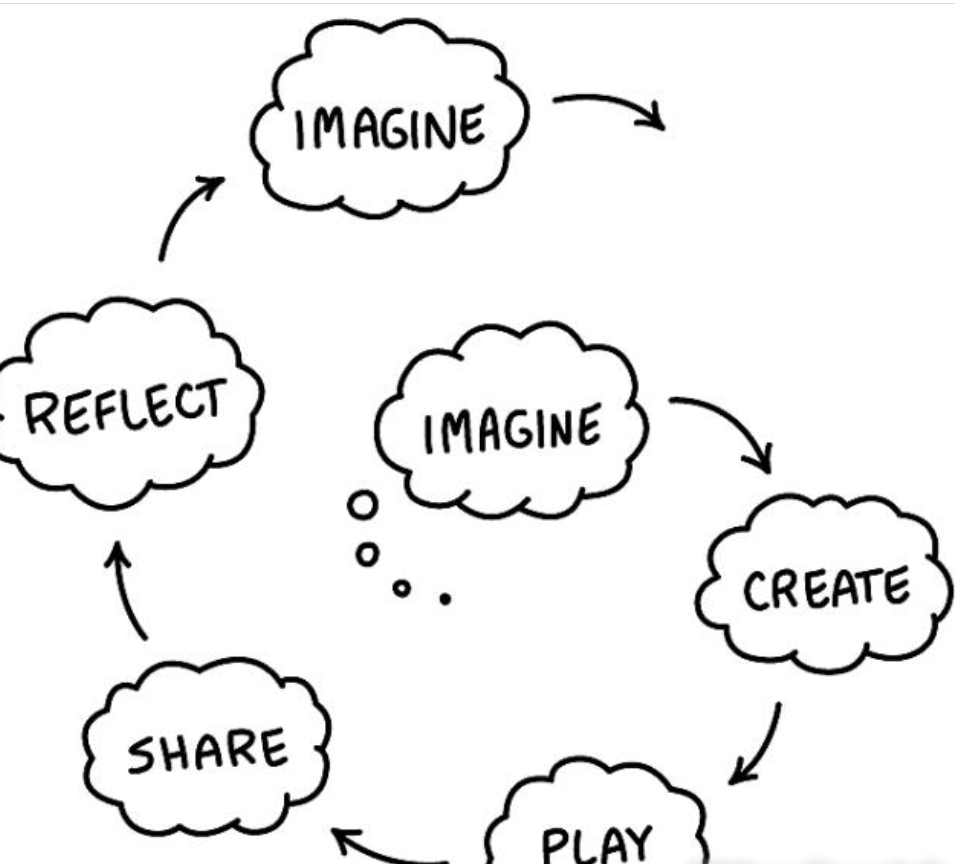

# 前言

> 使用一种计算机语言编写一串指令的工作，就叫作“编程”。
>
> 通过Scratch编程，孩子的记忆力（能记住多达几百个指令的组合）、想象力（能想象出复杂程运行的效果）、逻辑推理能力（算法就是最精妙的推理过程）都能得到长足的发展。
>
> 通过凭空想象设计出游戏自然是件很难的事情，但如果有成功的案例作为参考，你就可以在这些案例的基础上，慢慢酝酿出一些新的想法，从而进一步创造出令人赞叹的杰作。
>
> 本教程就像是一个跳跃点，站在它上面就可以展翅飞翔，在Scratch的世界里尽情徜徉！

## Scratch创始人总结的10条培养孩子创造力的技巧

**Scratch是一款由麻省理工学院（MIT） 设计开发的少儿编程工具。**

> 特点是：使用者可以不认识英文单词，也可以不使用键盘，就可以进行编程。

> 随着科技的发展，**创新能力也显得越来越重要**，很多家长也会让孩子学习编程，那么如何给孩子营造一个良好的创意学习的环境呢？

> Mitchel Resnick,教育技术专家，MIT媒体实验室学习研究教授，他带领团队开发了Scratch编程软件和在线社区。

> 培养孩子创造力最大的挑战不在于“培养创造力”，而在于能够营造让创造力生根、发芽、茁壮成长的环境。我们可以围绕以下五点营造环境：

- imagine（想象）：给出一个想法，让孩子去天马行空；
- create（创造）：通过创造将想象的东西和现实结合起来；
- play（动手玩）：孩子亲自动手使用工具和材料创作项目；
- share（分享）：孩子将完成的项目分享给其他人；
- reflect（反思）：在分享后，对项目的反思和改进。

> 这五个部分其实就是创意学习螺旋模型（如下图）。在这个过程中，孩子们会不断产生新的想法，然后开始螺旋学习，不断在想象、创造、玩耍、分享和反思的循环。在螺旋模型的每一次迭代，你都会找到支持孩子们创意学习的新的机会。

如何营造这样的螺旋式的创意学习环境呢？有如下10条建议，每个建议都包含了可操作性的案例。

1. **想象阶段：展示案例，激发孩子创意**

   > 一张白纸，一张空白的画布往往让人望而生怯。一组作品案例却能够激发孩子的想象力。
   >
   > 当孩子在学习Scratch课程的时候，孩子可以通过老师教授的课程，或者学习平台的社区中，寻找优秀作品。通过展示这些优秀作品，激发孩子的兴趣和激情。

2. **想象阶段：鼓励他们去“瞎搞”**

   > 帮孩子们找到好的点子，最好的方法就是鼓励他们大胆的“瞎搞”。
   >
   > 大部分家庭都有乐高玩具。建议家长可以这么做：最好有4、5个人一起参与，围坐成一圈，随意找一堆乐高积木块，从一块积木开始，每个人轮流在积木块上添加一块积木，当两三轮过后，大家可以根据一起搭建的积木块进行想象，然后不停重复这个过程。几轮之后，孩子就会想到自己想要做什么东西了。

3. **创造阶段：为孩子们提供多样化的原材料**

   > 给孩子提供各种各样的材料，让孩子涂鸦、搭建和动手实践。
   >
   > 曾经就有一个家长说过，他的孩子用“尼龙袜、报纸和鸟食”来制作自己的布娃娃。他说孩子用乐高积木和雪糕棒来搭建布娃娃的骨架，毛毡和纺织品用来做布娃娃的皮肤，钢笔和马克笔用来绘画，最后，孩子用胶枪和胶带把骨骼、皮肤粘到一起。一堆废品竟然也能做出一个布娃娃。
   >
   > 所以，其实不用什么高科技材料，只是一些乱七八糟的材料，孩子就可以创作出有创意的作品。作为家长，我们尽可能地提供多样化的原材料即可。

4. **创造阶段：找到能引起孩子共鸣的创作**

   > 不同的孩子有不同的兴趣，有的喜欢用乐高积木搭建房子和城堡；有的喜欢用Scratch制作游戏和动画；写一首诗或者一个短的故事同样是创作。我们要找到能引起孩子共鸣的创作类型。
   >
   > 让孩子尝试用各种工具去创作，找到自己最有共鸣，最有兴趣的工具，孩子们就能够对创意设计的过程有着更加深入的理解。

5. **玩耍阶段：给予孩子足够的时间玩耍**

   > 当孩子们沉迷于创造性的项目的时候，家长需要给予大量时间。
   >
   > 当家长给孩子规定时间完成项目时，孩子们就不会选择去思考，更倾向于按照老师的步骤一步步的完成。要让项目变得有创意性，需要孩子花费大量的时间去探索新的想法、进行不断的改进。所以家长最好会给予孩子几周甚至是几个月来让孩子们来创新自己的项目。

6. **玩耍阶段：孩子过程中的思考比结果更重要**

   > 当孩子们创作作品的过程中，最重要的是孩子在过程中的思考，而不是最终的结果。为了让孩子在过程中思考，家长可以询问孩子一些关于项目的问题，例如：在项目的过程中，最好特意安排孩子们分享他们的项目过程，并且和孩子讨论接下来打算做什么，为什么这么做？

7. **分享阶段：孩子和家长之间的分享**

   > 孩子的项目中，家长是孩子首选的分享者。所以在项目制作的过程中，家长的参与是机器重要的。家长需要找到一个能和孩子共同合作的角度，一起合作制作项目。在合作中，家长和孩子对于彼此的能力有了一个全新的认识，亲子关系也会更加紧密了。

8. **分享阶段：家长帮助孩子分享给他人**

   > 很多小孩都喜欢给他人分享自己的项目，但是却不知道怎么分享。家长这时候就可以帮助孩子分享。在Scratch编程学习中，家长可以将孩子的作品分享到魔扣少儿编程的学员家长微信群，让老师和同学一起来观赏孩子的作品。

9. **反思阶段：家长跟孩子分享自己反思和想法**

   > 告诉孩子你的想法，是你能够给孩子的最好的礼物了。无论对于大人还是小孩，思考都是一件不容易的的事情，让孩子们知道你关于项目的思考和解决问题的思路是非常有好处的。孩子们听见你的反思，就会更加积极主动的反思自己的想法。

10. **反思阶段：孩子的反思**

    > 项目完成后，让孩子反思一下整个项目的步骤同样重要。家长可以通过提出以下问题来促进孩子们反思：
    >
    > - 你是怎么想到这个主意的？这个问题促使孩子们反思到底什么促使和鼓舞了他们。
    > - 最让你惊奇的是什么？这个问题可以让他们不仅仅是描述自己的项目而且能够反思自己的创作经历。
    > - 如果项目出问题了，你可以问“你想要实现什么样的功能”，在描述他们目标的过程中，他们经常能够认识到问题出在哪里，不需要家长更多的启发和帮助。

## 少儿编程应该如何学习？

> 不少人对孩子学习编程都有一个疑问，少儿编程应该怎么学？接下来就和家长们分析一下学习少儿编程的方法。

### 少儿编程的学习目的是什么？

> 学习少儿编程的目的除了学习编程知识以外最经常被提到的就是——**编程思维**。毕竟并不是所有学习编程的孩子最终都会走上程序员的道路，所以对于这类的孩子而言更重要的就是学会编程思维了。那么到底什么是编程思维呢？

> 在各大少儿编程机构或者相关文章中被反复提到的学习少儿编程的主要目的之一**就是让孩子学会编程思维，用编程思维来解决遇到的问题**。为了便于理解，编程思维可以拆分成两个定义来看，**首先是编程，其次是思维，组合起来的意思就是用编程的方式来思考问题**。
>
> 那编程的本质是什么？用一句话来解释，**编程就是和电脑对话，用电脑听得懂的语言，告诉它我想让它做的事。**这种人和计算体系之间交流的过程就是编程。简单讲，**编程就是人与计算机的交流，人机对话。**
>
> 所以，要跟电脑沟通对话，我们也必须让自己变得理性、严谨起来，从电脑的角度去思考问题，这就是所谓的编程思维。而通过逻辑、分析问题、分解问题、按序处理问题，这种解决问题的思考方式可以适用于解决所有问题。

### 应该用什么方式来学习编程

> 学习编程一定要多动手勤思考，多做多练，孩子们一般会有两个极端，**一个是只想不做，一个是只做不想，这两个极端都是错误的。**
>
> 孩子们的学习教程大多都是文字材料外加操作视频的，文字材料一般会有操作的截图和相应的文字说明讲述设计的思路和原理，视频会录制整个程序的操作过程。
>
> 建议家长让孩子们按照以下的顺序来学习：**先看一遍文字材料，了解这节课程是要做什么，实现的思路和原理是怎么样的，思考为什么要这么设计，然后带着这些问题去看视频操作；看视频操作可以采用随看随做的方式，看一步停止视频，仿照视频自己操作一步，操作一步消化一步，直到整个视频播放完毕，学会整个操作。**
>
> 仿照视频操作一遍后，在脑子中回顾一下整个设计操作的过程，每一步是怎么做的，为什么这么做，把整个过程都理解透，然后让孩子自己再独立操作一遍，并给爸爸妈妈讲解演示。这样不仅锻炼了编程，还能增强孩子的表达能力，让孩子更全面的进步。

> 上面讲述的这个方法会更适合在上录播课或者能够独立学习的孩子，对于家长而言不一定要懂编程、会编程，但是需要知道怎么正确的去引导孩子进行有效的学习。
>
> 对于通过直播学习或者线下学习的孩子，家长们应该更为关注教课老师的反馈，去了解孩子在学习中的态度和表现，而不仅仅只是关注结果。特别是对于年龄较小的孩子，这个时候应该是寓教于乐的阶段，培养孩子学习的兴趣和方法。
>
> 另外对于有兴趣并且有能力和时间的孩子们，家长可以尝试引导孩子修改程序中的设计，加入自己的思路，创建属于自己的程序，做到举一反三，让孩子不仅仅限制于课程内容，锻炼孩子的发散思维。

谢谢！

*本节内容参考自Scratch中国少儿编程网*

