# Scratch的基本信息

> 中文名字”猫爪“
>
> 在学习如何使用Scratch进行编程之前，你需要知道它的来源以及每个组成部分，这就如同不知道需要哪些食材就无法准备晚餐一样。
>
> 此部分将了解界面、角色和积木，以及如何运用它们制作出酷炫的游戏！

## Scratch的来源

> 使用积木来编写代码，让编程操作变得简单易懂。
>
> 简单来看，可以这么认为，它把编程中最核心的东西抽离出来，让孩子接触。具体编写出来的”代码“就像下面这样。
>
> 做项目过程中的很多思维恰恰是编程的核心。
>
> 即便Scratch可以培养一些思维，也只是很表象的编程思维。但兴趣真的是可以培养，这个不可否认，不然也不会如此受追捧。
>
> 学编程的初衷，为了思维。
>
> Scratch是编程的非常初级的启蒙形式，只是做了一个很简单的预备，这点从各大网课平台通常都只有一年课程就不难看出。也就是说，这东西在认知达到相应水平的情况下，大约一年就全学完了。
>
> 后期真的要在学生阶段继续接触编程，现在比较热门的还是Python，这一切都是为了后续这些做铺垫。

## Scratch的各个部分

> 千万不要认为程序设计离我们很遥远，其实它就源于生活的各个方面。

> 现实生活中，每天遇到的叔叔、阿姨、老师和同学等不同人物，每天都会见到的书本、花草、面包和汽车等不同物品，这些在scratch中叫做角色。

> 现实生活中，我们在超市里购物，在公园里散步，在操场上打球，在大海里潜水，这些不同的场景在Scratch中叫做背景。

> 现实生活中，老鼠见到小猫撒腿就跑，火箭能够飞向太空，小鸟在枝头叽叽喳喳叫个不停，这些都可以在Scratch中实现。我们赋予角色声明，方法就是为它们撰写脚本。

> 超级简单吧！角色、背景、脚本，有了这三要素，我们就可以开始设计自己的作品啦。

### Scratch由七部分组成

> 界面、角色、舞台、积木（指令）块、造型、背景、声音

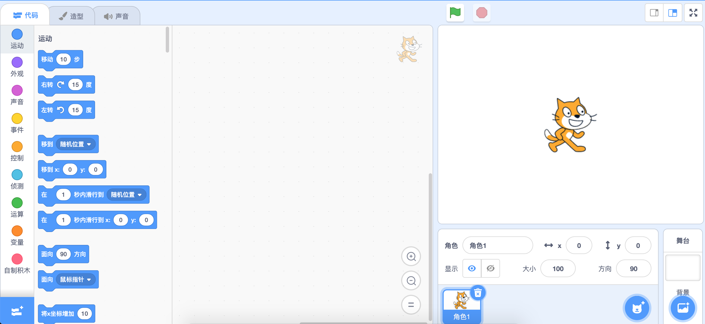

- 界面

  > 界面控制着程序在屏幕上的显示。
  >
  > 当前版本的界面如上图，有三个主要的区域：
  >
  > - 右下角的角色区用于为游戏添加不同的角色和物体；
  > - 工作区中，可以创建代码、调整造型以及进行其他修改；
  > - 舞台是玩游戏的地方；

- 角色

  > 例如漫步的卡通人物、飞球或流星。Scratch编程称这些对象和物体为角色。

  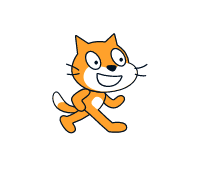

  - 角色区

    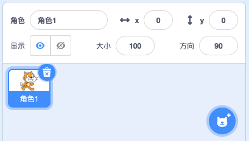

    添加角色的四种方式：

    - 上传角色

      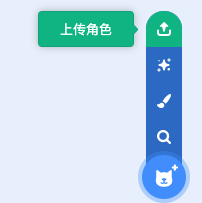

    - 随机选择

      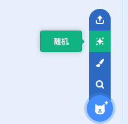

    - 绘制

      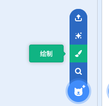

    - 选择角色

      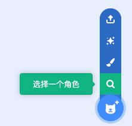

    

  - 位图图像和矢量图像

    - 位图图像由像素制成，而像素就是屏幕上一个个的小点。在屏幕上看到的所有内容都是由像素构成。

    - 矢量图像，计算机不会像绘制位图图像角色一样记住每个像素，而是会记住绘制图片的线条和形状。

      （当计算机按照绘制方式保存图片时，就会创建出一个矢量图像。）

      两种图像形式可以互相转换（不可逆）：位图图像角色的颜色比较饱满，缺点是一旦画好，难以调整。如果绘制之后还需要进行编辑，最好用矢量图来绘制角色，调整起来方便。

      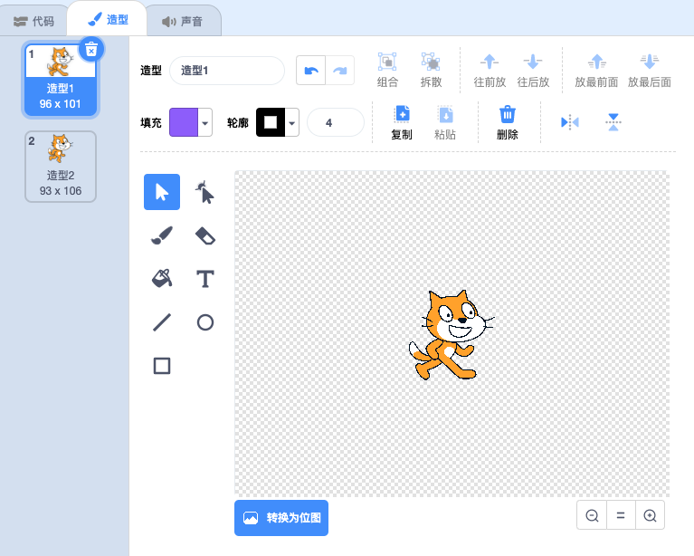

- 舞台

  > 完成的作品可以在舞台上进行展示。舞台可以呈现不同的背景和角色。

  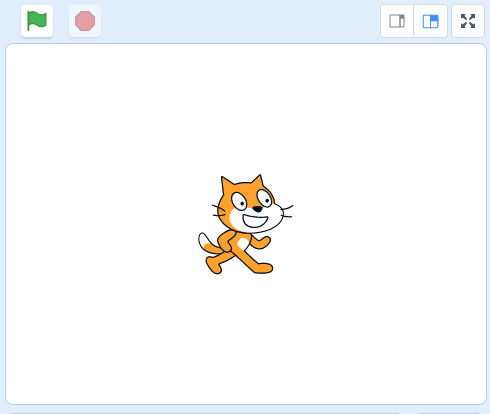

- 积木（指令）块

  > 让角色动起来，需要通过积木块（指令）的组合，告诉角色要做什么。
  >
  > 每个积木块都有自己固定的类型和颜色：例如所有动作积木块都是蓝色，所有外观积木块都是紫色的。

  - 在其他积木块内添加积木块

    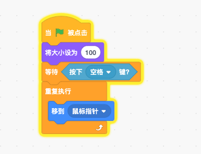

    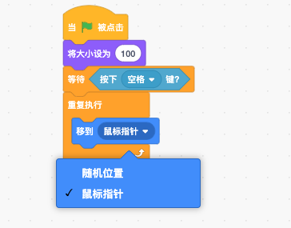

    当积木中没有矩形区域的情况下，就不能在其中放置另一个积木块

    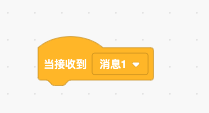

  - 背景与角色

    并不是只有角色才需要添加积木块，也可以为背景添加积木块。

    并非所有适用于角色的积木都适用于背景，例如让背景说些什么没什么意义。

  - 积木（指令）块类型

    Scratch通过创建的操作类型将积木组合在一起，以下是不同类型的积木及其功能。

    - 动作积木为深蓝色，控制角色所在的位置。
    - 外观积木为紫色，可以切换背景或角色的造型。也可以让角色说些什么甚至让它消失
    - 声音积木为粉紫色，可以让角色发出各种有趣的声音。
    - 事件积木为黄色，可以在角色之间发送传递消息。
    - 控制积木为浅橙色，控制其他积木块而不是角色，比如使积木重复或停止脚本等
    - 侦测积木为浅蓝色，用来侦测如果角色触碰某种颜色或如果按下某个键会怎样。
    - 数字和逻辑运算积木为绿色，帮助将积木块组合在一起或进行数学运算。
    - 变量积木为深橙色，可以创建一个特殊的积木，用数字或单词命名。
    - 自制积木（我的积木）为红色，没有预设。在这里可以制作属于自己的积木。
    - 扩展积木：参见扩展部分

  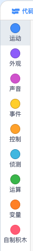

  - 积木形状

    > 帽子积木：用来启动程序。
    >
    > 堆叠积木：可以在顶部或底部连接其他积木。
    >
    > 报告积木：是椭圆形的。告诉你游戏中的其他内容。例如可以回答诸如”现在几点？“之类的问题。这些报告积木必须添加到具有椭圆形缺口的其他积木中才能工作。
    >
    > 条件积木：形状像六边形。特殊类型的报告积木，只用说”是“或”否“。也是添加到具有六边形缺口的其他积木中。
    >
    > C形积木：用于在C区域内添加其他积木。可以放置任意数量的积木。C形积木可以让内部的积木进行循环或检查是否会发生其他情况。
    >
    > 结束积木：也叫底部积木，下面不能连接任何其他积木。是用来停止程序的。

- 造型

  > 角色们具有很多不同动作的图像。通过有序添加这些造型，你就可以让你的角色看起来像是处在移动过程中一样。如下是Scratch角色附带的两种不同的造型：
  >
  > 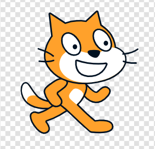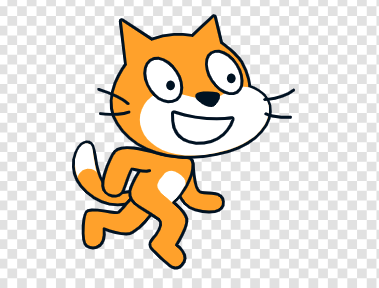
  >
  > 通过对上面两个造型进行切换，让它看起来像是在走路。
  >
  > 可以在工作区左上角的”造型“选项卡上找到不同的造型。如果单击”选择造型“，则可以为角色选择新的造型。还可以绘制自己的造型，加载已有的其他图片造型，或者拍张照片作为自己的造型。
  >
  > 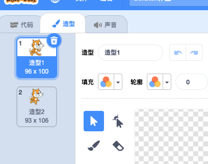
  >
  > 上传一个造型：
  >
  > 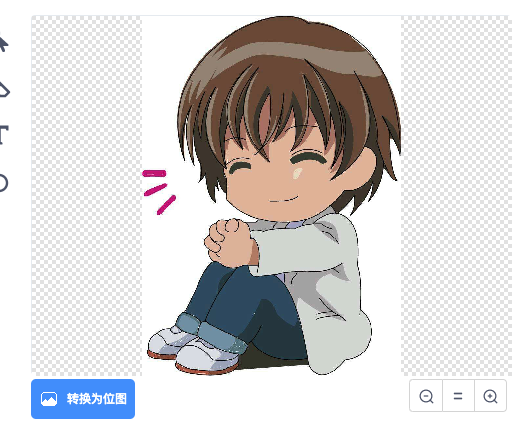
  >
  > 造型和角色的区别：造型是角色的一部分，如方向和或位置。可以改变角色的造型，之前的造型也可以保留下来，每个角色可以有很多不同的造型，但一次只能显示一个。还可以控制角色在哪个时间点摆出哪个造型。

- 背景

  现在的舞台，是一张白色的幕布，单调乏味。

  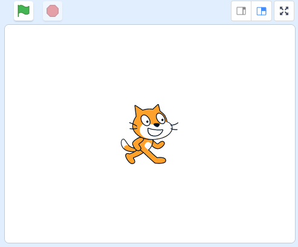

  可以添加一个背景：

  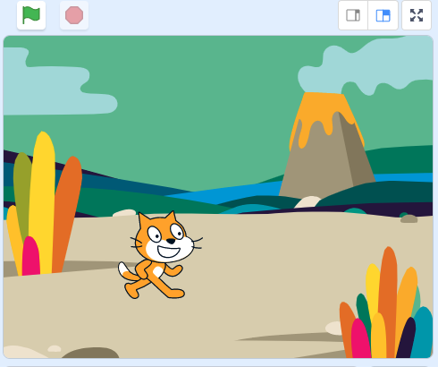

  可以有多个不同的背景，来回切换。

  添加背景的方式和添加角色的方式相同，也有四个选项，分别是：上传背景、随机、绘制、选择一个背景。

  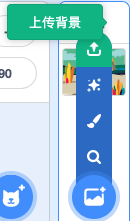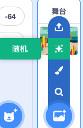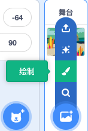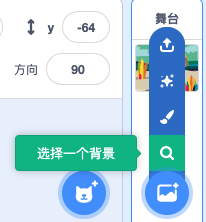

  > 背景与角色是两个不同的概念。毕竟不能像移动角色那样在屏幕上随便移动背景。你的角色会侦测它是否触碰到你背景中的颜色，但这与侦测两个角色是否触碰有所不同。例如，可以制作迷宫，迷宫作为一个角色，可以很简单的侦测角色是否触碰到了迷宫；迷宫也可以作为一个背景，就必须让你的角色侦测特定的颜色来判断。

- 声音

  > 通过为角色添加声音特效，可以让Scratch游戏更加有趣。就像可以使用已经制作好的、自己绘制的或上传的角色一样，Scratch声音部分可以让你从已经制作好的数百个选项中进行选择，也可以录制自己的声音，选择随机的声音，或者从文件上传声音。

## 开始学喽

> 了解完Scratch的各个部分，现在就让我们开始深入学习所有的编程积木块，以及如何利用它们让你的程序运转起来。
>
> 后续的章节将教会你不同类型的积木（指令）块，以及如何使用它们来制作一些非常有趣的游戏。
>
> 学习就要开始咯！

Let's Go!