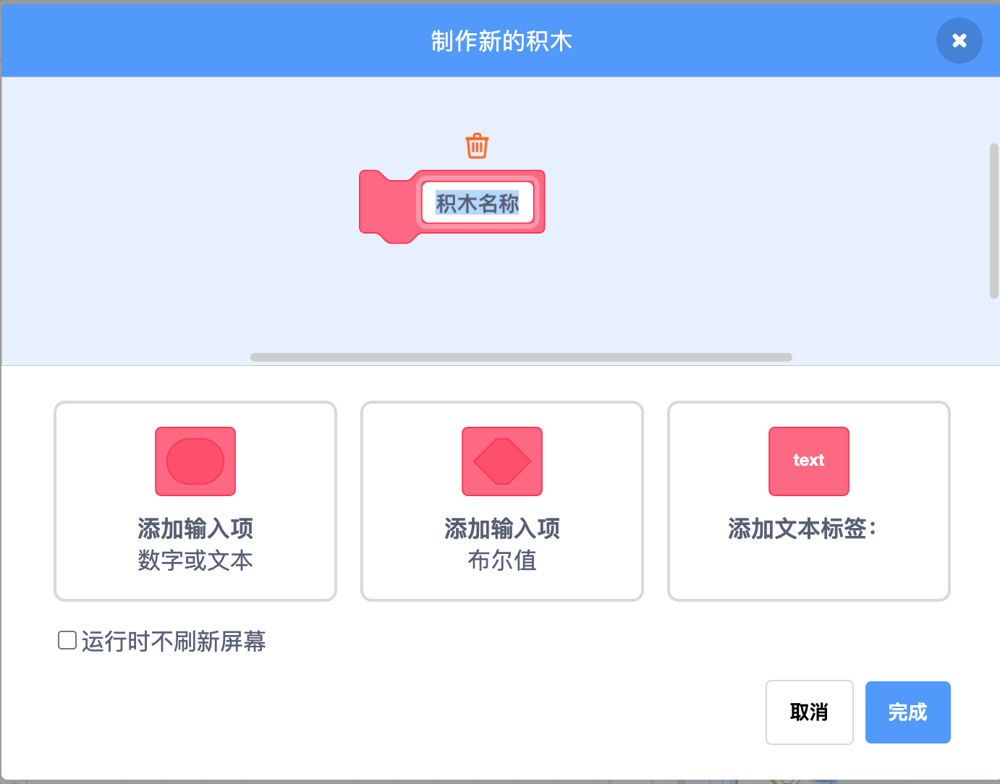

# 我的，全都是我的！——我的积木

> 随着你在Scratch上的项目越来越多，你会创造一些惊人的东西。但要完成这些惊人的项目，你需要使用大量的积木。每个伟大的程序员都有方法让工作有序进行，不然程序就乱套了。创建自己的积木可以让你的程序井井有条。但是不要太迷恋积木哦！
>
> 优秀的程序员都会告诉你，计算机科学的艺术在于知道在恰当的时间、恰当的地方使用积木！

## 给我无限的积木！

> 开始学习更多积木时，可能最好的方法就是制作一个积木。让我们开始进入到积木的实际操作部分吧。如果你单击左侧的“我的积木”，就会看到一个名为制作新的积木的按钮。点击此按钮，会弹出一个窗口，就可以制作你的新积木了。

> 在这里你可以创建一个新的积木，它的使用方法就和你学过的其他积木一样。你可以选择三个高级选项添加到新的积木里。但是对于一个简单的积木来说，这些选项是不需要的。随后，当你创建更高级的积木时，会看到如何添加输入项来将椭圆形或六边形放入新的自制积木中。
>
> **对于一个简单的积木来说，不需要添加任何高级的选项。**

> 现在，从最简单的开始，做一个简单的“跳舞”积木吧。这个“跳舞”积木应该出现在工作区中，上面写着“定义跳舞”，并且应该有一个“跳舞”积木在你的“我的积木”区域。但是，“跳舞”积木什么也做不了，除非你告诉它应该怎么做。所以让我们给“跳舞”下个定义吧！

> 在“定义跳舞”积木下，让我们添加一些积木来让角色来回跳舞。我们不希望它们突然上下跳动，所以应该添加“将旋转方式设为左右旋转”积木。你也不希望这个动作一直持续，所以可以添加一个“重复执行直到__”积木，内置一个“计时器>2”运算积木。这会使得它在两秒后停止。（你应该在此操作之前设置一个“计时器归零”积木，这样的话你每次想让它跳舞都可以重新开始。）

> 最后让你的角色跳舞吧。添加“右转180度”和“等待0.2秒”积木。现在，当你把“跳舞”积木放在一个事件积木下面时，如“当角色被单击”，它就准备好了。
>
> 
>
> 
>
> 

> 自制积木最好的方法是把关系到“定义跳舞”积木的全部代码置于“当角色被点击”积木下的“跳舞”积木内。
>
> 在此情况下，无论你何时使用“跳舞”积木，他都涵盖了所属这些积木。它可以使你的角色做这些跳舞动作，而不必每次让角色跳舞时，都要复制这些积木。

> 现在来介绍几个名词。当创建新积木时，事实上你是在创建一个功能。该功能是一组积木，包括你的新的“跳舞”积木。给它起一个名字可以清楚的知道这些积木是干什么的，这样以后也不容易忘记。
>
> **功能：功能是你将一组独立的积木组合在一起工作。在Scratch中，功能是在自制积木中创建的，以“定义__”积木开始。你可以把这个功能用于不同组的代码中，而不必再重复设置所有的积木。**
>
> 起名字的时候，应该更容易通过名字知道这个积木是干什么的。例如，使用名称“重置”是可以的，但“重置外观”更好，因为它更清楚地显示了这个积木将只重置角色的外观，而不是其他东西。

> 输入（有时也称为参数），允许你在一些位置进行添加，你可以在你的自制积木中添加数字，单词或其他积木。积木中所有的空白输入项，都可以添加东西，这叫作输入。数字输入是圆形空格，就像“移动__步”积木一样。布尔输入是六边形空格，就像“等待\_\_”积木一样。
>
> 
>
> **输入：输入是在自制积木中进行的，当你创建一个自制积木时，你通过输入决定参数类型。**

> 你在新积木中输入的变量（例如你把10添加到“移动10步”）被称为命令行参数。这个词的意思是信息。对于你的新积木来说，命令行参数为其提供了它所需要的额外信息。
>
> **命令行参数：使用自制积木时，命令行参数为参数提供变量。命令行参数具有实际的数值。这是与输入的唯一区别。**

> 当脚本变得非常长时，输入就大有用处了。假设你想为你的角色添加一些不同的跳舞动作。你可以继续添加积木，这些积木组合在一起即可以进行一些不同的跳舞动作。这些积木可以使角色在三个不同的时间进行三种不同的跳舞动作。你可以通过查看每个重复循环来猜测它不同的跳舞动作的样子，还可以看出每个动作的时间长度。
>
> 

> 但是，如果想选择你的角色所做的跳舞动作或时间长度，要确切地知道在哪进行这个选项并不容易。但你可以使用输入来帮助！
>
> 尝试创建一个“跳舞\_\_到\_\_秒”积木，输入一个数字表示“风格”，在标签“到”后输入一个数字表示“时间”，然后是标签“秒”。然后你就可以轻松的设置你想要你的角色跳什么舞蹈，跳多长时间。脚本看起来是这样的。
>
> 
>
> 这和以前一样做了三个跳舞的动作，但是现在你可以选择要跳的舞，按照哪种顺序进行，跳多长时间。输入的参数可以是“弹跳”“翻转”或“迪斯科”。通过使用“\_\_包含\_\_”操作符，你甚至可以将一些舞蹈组合在一起！通过这些更改，你现在可以轻松地重新排列动作，重复或更改动作持续的时间。

## 运行时不刷新屏幕

> 创建新的自制积木时，你可以进行另外一项设置。就是运行时不刷新屏幕选项。
>
> 
>
> 当第一次创建积木时就可以启用此功能，或者你单击右键选择“编辑”。最初你创建新的积木弹出的窗口会出现，你可以单击“运行时不刷新屏幕”选项。

> 让我们看看它是如何工作的。你创建一个名为“自制滑动”的积木，不选择“运行时不刷新屏幕”，添加一个椭圆形“步骤”输入。将角色定位在左下角，并将其指向你想要它滑动的方向。然后等待1秒钟，稍后当你选择运行时不刷新屏幕时，你可以看到它移动到这个位置，然后执行自制滑动250步。
>
> 
>
> 区别：勾选了运行时不刷新屏幕，角色直接跳到目标位置；不勾选运行时不刷新屏幕，角色每移动一步都会看到。
>
> 勾选了运行时不刷新复选框，屏幕没有刷新，Scratch并不会在每个“移动1步”积木后显示角色所在的新位置。但它在执行操作，而且速度快到你看不清。只有当“造型滑动\_\_步”完成时，Scratch才会在舞台上的最终位置显示角色。这意味着计算机的工作量较少，因此它可以比其他方式运行快得多。
>
> 这就是为什么角色从起点到目的地的速度很快。有些人看到他们的角色在屏幕没有刷新的情况下快了500倍。

## 意识到何时需要使用自制积木

> 知道如何制作自制积木并不是你唯一需要学习的事情。你还应该知道什么时候去用它。最简单的使用自制积木的时候就是当你看到你的一些积木都在做同样的事情。比如说你想将十个角色发送到它们的起始位置并且重置它们的大小和颜色。你只需要在代码后添加一个自制积木，就无须多次重复操作。而且，当你想重新合成别人的项目时，它还能帮你清楚地理解这一组积木可以做什么。
>
> **重新合成：一个重新合成就是你把别人的项目加以修改，变成自己的。**

> 到目前为止，你一直在进行自己的项目，但是在Scratch中，你也可以修改别人创建的项目，这叫作重新合成。重新合成别人的项目就是把别人的项目改变为你想要的样子。Scratch上有一些非常受欢迎的用户，有成千上万的人拿他们的项目来修改。

> 为了像这样受欢迎，这些Scratch用户们花费了很长时间确保他们使用自制积木有序组织代码，以便当人们比如说你，看他们的项目时，比较容易理解。如果它只是一大组积木，基本上不可能搞清楚这些积木的功能是什么。

> 因此，当你编写代码时，问问自己，“我是不是已经有类似这样的了呢？”如果答案是肯定的，那更好的办法就是把你已有的积木改为自制积木。

> 使用自制积木可以让你的程序井井有条，使用更少的积木，帮助你了解这些积木的功能，使你更容易修改自己的项目。

> 确实，要知道什么时候使用自制积木很难。这需要练习和反复试验。如果你能用好它，它们当然可以做这些事情。但如果你没有给它们起一个合适的名字，或者积木内置代码过于混乱，那你的积木可能比没有自制积木更混乱。学习的最好办法就是去做，所以行动起来组织你的代码吧。

## 游戏——跳跃积木

> 这个活动是创建一个项目。一个障碍物会在屏幕上移动，Scratch猫需要跳过它。猫跳跃障碍物的次数越多，分数就越高。

### 添加你的角色

> 本示例中还是使用Scratch猫，你当然可以使用其他角色。
>
> 先将角色移动至屏幕的左下角。现在需要使用小刷子图标绘制自己的角色。只需绘制一个矩形积木（确保选择矩形绘图工具）并将其命名为“障碍物”。将其绘制为25*150。你可以在左侧角色图标下方看到尺寸。这就是我们的角色需要跳过的障碍物了。

> 现在你的屏幕上应该有两个角色。请注意，此示例中，使用的是侏罗纪背景，但你可以使用任何你想要的背景。
>
> 

### 让角色跳跃

>你可以在Scratch中创建许多不同类型的跳跃。例如，变量可以帮助你创建更逼真的跳跃，可以通过增加重力和速度，使其更像是落入现实世界。但这可能非常复杂。对于此活动，你将创建一个简单的跳跃动作，就是简单的上下跳动。

> 目前为止，我们已经学到了很多东西。当按下空格键后，你认为你的角色会怎么跳起来，然后怎么上下跳动呢？它可能看起来像这样。
>
> 

> 在Scratch猫里有一种造型可让它看起来像跳跃，如果你使用它的话，你可以添加一个改变造型。
>
> 请记住，在游戏开始时指示玩家应该做什么是很重要的。使用“移到x：\_\_y：\_\_”积木将角色发回到起始位置也很重要。你应该添加这些积木在里面。
>
> 

### 障碍物移动

>这个示例中，最棘手的脚本就是障碍物在屏幕上的移动，同时还要检查它是否触碰到你的角色。所以我们应该使用自制积木使我们的代码井井有条而不是用很长一堆积木！

> 我们需要制作的第一个积木是在游戏开始时显示障碍物。还需要一些变量来显示Scratch猫跳跃的次数以及它成功通过障碍物移动到下一级别的次数。每当项目首次启动时，请将这些变量设置为零。谁也不希望在角色给出指示时出现障碍物，所以在开头时隐藏它然后再角色说完话后显示它。
>
> 

> 小提示：范围不要太大，请把障碍物尺寸设置为一般尺寸范围。

> 下一个自制积木将显示障碍物如何移动。我们需要告诉障碍物我们想要它移动的位置，首先告诉它你希望它从哪里开始，使用“移到x：\_\_y：\_\_”积木。但是如果障碍物高度总是一样，或者你每次都能猜到它要去的位置，那就没有乐趣了！你可以让它的高度随机生成，这就比较有意思。使用“随机选择-50到50”积木来控制障碍物的高度。现在每次角色重新开始，障碍物都会有一个随机的高度。

> 最后，你可能不希望它立即移动，所以在最后添加一个“等待1秒”积木。
>
> 

> 现在，游戏开始，障碍物出现了，让它在屏幕上移动吧。
>
> 同样，一个很好的方法就是使用一些自制积木。创建一个名为“滑动障碍”的新的自制积木。让障碍物一直前进，直到它到达左侧。你可以通过使用“重复执行直到\_\_”积木来执行此操作，条件为“x坐标<-235”。这意味着当障碍物到达左侧时，这个积木会停止。
>
> 

> 如果你希望障碍物在舞台上水平移动，这听起来像是“将x坐标增加\_\_”积木的工作！为了好玩儿，让障碍物随着等级变高移动得快一些。

> 在“将x坐标增加\_\_‘积木的椭圆形输入内，你可以使用运算积木使障碍物按照级别变慢。如果你将等级变量乘以2，然后从中减去20，你会得到一个负数（意味着障碍物将向左移动），当级别上升时，这个负数会变小（意味着障碍物将减慢）。当障碍物穿过舞台时，它会检查是否正在触碰你的角色。让我们为此创建一个自制积木吧，将其添加到”滑动障碍“中。

> 你将此自制积木叫做”检查触碰“，如果Scratch正在触碰障碍物，玩家就不能成功跳过去。玩家就输了！要做到这一点，请使用”如果\_\_那么“循环和侦测积木来确认障碍物何时接触到你的角色。如果想让玩家知道他没有成功，那么在障碍物碰到你的角色时，添加一个外观积木显示”再试一次！“一旦玩家输了，就不再需要障碍物，且游戏结束，所以在这里添加”隐藏“积木和”全部停止“积木。
>
> 

> 我们需要这些自制积木使你的障碍物在屏幕上移动。所以现在我们必须把它们放在一起。

### 将积木放在一起

> 从”启动障碍“积木开始，对吧？
>
> 如果你想让障碍物到达恰当的位置，那么”障碍复位“积木应该是下一个。最后，你应该有”滑动障碍“积木。你希望障碍物能够继续回到原来的位置并向前推进整个游戏，应该在”障碍复位“和”滑动障碍“积木上添加一个”永久“积木。
>
> 

> 现在障碍物在屏幕上移动，而且高度在变化，接触到角色时会有提示。最后一步是计算你的角色跳跃的次数。然后就可以在玩家跳过五次障碍后升级。通过每次”跳跃“变量上升来启动此自制积木。你觉得你应该如何做呢？
>
> 

> 要做到这一点，你需要一个”如果\_\_那么“循环”\_\_除以\_\_的余数“和”\_\_=\_\_“运算积木。请记住，余数表示将第一个数字除以第二个数字时的余数。因此，如果跳跃次数为4并且除以5，则不会等于零。当”跳跃“是5并将其除以5时，余数将为零且等级应该上升！为了好玩，每次玩家升级时，你可设置更换背景。将”检查下一等级“积木添加到使角色跳跃的代码后面（这些积木用”按下空格键“积木启动）。

Let's Go!