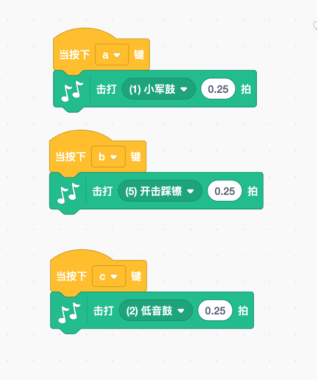

# 兴趣拓展——拓展内容

> 你认为在Scratch中仅仅只有之前的那些积木吗？不，其实还有更多你未曾接触过的积木在等着你！
>
> 在本章中你将学习有关Scratch中的所有扩展内容，你会看到许多有趣的积木，然后再用这些有趣的积木制作出让人眼前一亮的东西。
>
> 不过，有一点需要注意，那就是在每一次制作过程中，并不会用到所有的积木，而只有在你添加这些特定的积木之后，整个制作过程才算完成。
>
> 这种将特定积木一一添加的过程，也为你编程减少了许多不必要的麻烦，同时也加快了软件本身的运行速度。

> 本章的扩展内容包括音乐、演讲和视频功能。
>
> 在之后，我们也会创造出越来越多你从未见过的积木，因此大家一定要经常查看“扩展部分”，以便了解最新的积木功能哦。

> 在编程软件的左下角，你会发现一个带着一些白色积木和加号的蓝色按钮，点击后，就可以获得更多的积木了！而这个蓝色按钮正是带你进入扩展部分的一个通道。

## 音乐

> 音乐是我们要接触的第一个扩展项目。通过使用这些积木，我们可以演奏乐器和鼓，还可以播放它们的声音，甚至还可以制作自己的歌曲。
>
> 
>
> 我们可以从中随意选择多种不同的乐器。比如说我们比较熟悉的大提琴和萨克斯管，或不怎么接触电颤琴和马林巴。让我们来尝试一下这些不同的乐器会演奏出什么不同的声音吧。
>
> 

### 演奏鼓和乐器

> 演奏这些乐器有一种非常有趣的方式，那就是将积木与键盘上的各个按键联系起来。比如说，你可以使用键盘中的a、b、c键来播放鼓，使用j、k和l键盘来播放其他不同的乐器，从此刻开始，你将拥有属于自己的管弦乐队！

> 如果你在不同的指令中按键速度足够快的话，就可以制作一些有趣的声音。现在，就让我们添加更多的按键和相应的乐器，来让演奏更酷吧！
>
> 

>小重点：音符编号是钢琴键盘上的音符。有一种键盘被称为midi键盘，它的第六十键称为Middle C键。从六十键往下数，音调越来越低，往上数会越来越高。

> 那我们可以赋予音符什么值呢？如果你想要听到每一个音符，你可以创建一个“音符”变量并将其放入“演奏音符__\_\_拍”积木。然后添加“将音符增加1”积木，并在这两个积木外部添加一个重复执行积木，就会按顺序播放每个音符。你可以注意到，在音符值达到20之前，这些音符听起来并不像任何声乐，而当音符值达到20到120之间，音高才逐渐增加，但是到120之后，音高的增加便停止了。
>
> 

### 休止符

> 有没有去过学校的音乐会呢？或者自己是不是乐队里的一员呢？如果去过音乐会，那么你可能会发现一些乐队演奏家在其他人演奏的时候什么也不干。其实他们什么也不干的原因是在那段时间里，不需要他们演奏。

> 与此相同，我们在编程中同样可以通过使用“休止__节拍”积木来完成。无论你使用什么乐器，又或者选择多少个节拍，你都可以让它暂停。通常一个节拍是一个音符的长度。这样，如果一个人休息一个节拍，而其他人都播放一个音符，每个人在相同的时间量呢仍然会在同时演奏。同时，你要注意，节拍和音符的持续时间都被“节奏”所控制。

### 节奏

> 节奏控制着节拍的持续时间。速度通过每分钟节拍数（或bpm）来衡量。因此，如果你将速度设定为60，那么它将每秒播放一次。如果想在一分钟内加快音乐速度并获得更多音符，你可以通过“将演奏速度增加”积木来完成。而如果你将速度改为120，那么每半秒就会播放一次。

> 小知识：节奏，节奏控制声音播放的速度。它是根据每分钟声音（bpm）中的节拍数来判断的。因此，如果你将节奏设置为60，节奏就是一秒钟一次。
>
> 

> 现在让我们来看看这种情况吧！将“演奏速度设定为60”积木添加到你选择的任何动作编码积木。这块积木可以供你选择任何节奏。而这种节奏需要一种乐器，你可以使用“击打鼓__拍”积木，并将其置于“重复执行”下以便它继续播放，这样就完成了。

> 现在激活你的脚本来听一下节拍吧！尝试用更高或更低的速度来查看节拍的变化。
>
> 

> 小提示：有时你可能想要在游戏中间改变速度。也许玩家在游戏中正处于一个非常困难的部分，而你想让音乐变得更快。你可以使用“将演奏速度设定为__”积木。这样，在脚本运行时，节奏可以变快或变慢。

> 我们还会看到一个圆形的“演奏速度”积木。就像其他圆形积木一样，你可以将它放在另一个积木中的任何圆形输入中。如果你想让一个角色说出的话与一个讲话泡泡中的当前速度保持一致，或者你想要做一些比如将节奏改为正常情况的一半这种操作，这种方式就很有帮助了。
>
> 

### 高级乐器会使用音轨

> 当我们听乐队或音乐会演奏时，通常会有多台乐器同时演奏部分音乐。每个演奏中的乐器都叫做音轨。而你也可以在编程中制作音轨！这将有助于你的音乐协同工作，听起来非常棒。

> 现在，让我们看看如何使用音轨制作音乐吧。通常情况下，如果你将一个乐器积木放在另一块积木之后，那么直到前一块乐器积木停止播放之前，后一块积木都不会开始播放。我们可以使用“广播\_\_”和“当接受到\_\_”这两个我们在前面章节学到的事件来解决这个问题。由于这些事件会同时发送消息，所以你可以让所有乐器都一起播放。

> 如果想用三种乐器演奏，你可以使用“音轨1”、“音轨2”和“音轨3”三种广播信息。如果你希望这些信息永远保持播放，你可以在它们外部添加一个重复播放积木，然后再顶部添加一个帽子事件，以便于启动。对于此示例，你要使用“当绿色小旗被点击”积木。最后如果想给乐器一些时间来播放，你可以在“广播音轨3”之后添加一个“休止1节拍”。如下所示：
>
> 

> 现在，如果要组成一支乐队，那么对于乐队的第一首曲目，则需要从“当接收到音轨1”积木开始制作，相应的它就知道要等待来自“广播音轨1”的消息了。然后我们再添加一个乐器，如电钢琴。因为它需要知道要播放的音符，所以你要添加“演奏音符60 0.25拍”积木。但这只会播放0.25节拍！如果你想要一个完整的节拍，那就需要继续添加“重复执行4次”积木包围其余积木，以增加一个节拍。
>
> 

> 让我们用第二个音轨做同样的事情。在“当接收到音轨2”下添加1个低音鼓。由于每个节拍只能播放1个鼓，因此不需要在其周围使用“重复”积木。
>
> 

> 让我们用第三个音轨做同样的事情。现在添加“休止0.25拍”积木，在“当接收到音轨3”积木时，选择一个乐器。单簧管听起来很不错，你就添加它吧。添加”演奏音符65 0.25拍“积木以告诉它要播放什么。现在你只能进行0.5次节拍，所以添加一个“重复执行2次”积木以使其成为一个节拍。你的代码应该看起来像这样。
>
> 

> 按下绿色小旗，来一起听听我们制作的音乐吧。很好！相信我们很快就会写我们自己的歌了！尝试添加更多乐器并更改节拍数量，让它们都成为你自己的音乐吧。
>
> 

## 画笔

> 既然你已经成了一名大师级音乐家，是时候学会做一位画家了！在扩展部分，第一个是音乐，还有一个标有画笔的框。单击它，就可以显示所有画笔积木了。
>
> 

> 我们可以使用其中的任何角色进行绘制。也就是说这些角色的位置和方向代表着画笔绘制的地方。就像角色可以改变它的位置和方向一样，画笔本身也可以改变宽度、颜色，以及它的落笔方向。当画笔下降时，这意味着它正在绘制，就像在现实生活中用笔在纸上绘画一样。当它抬时，不会绘制任何东西，就像我们把笔从纸上拿开了一样。

### 使用画笔

> 我们在编程中使用画笔时，其实看不到实际的笔。那么就需要想象一下，你屏幕前的角色正拿着一支看不见的笔，当你告诉它要去哪里时，它就会根据你所指的方向进行实际绘图。

> 如果在现实生活中画画，会选择恰当的颜色和尺寸吧。在Scratch中也一样，你要选择合适的颜色和尺寸，来使你的绘画更加完美。首先，选择画笔的大小和颜色，设置画笔降落，通过移动角色的方向和位置（记住角色正拿着一根隐形笔），让它绘制你所需要的线。

> 在开始绘制内容之前，我们需要了解“全部擦除”积木。这个积木能够清除已经在舞台上绘制的所有东西，可以将它放在事件积木的后面。因为这样你就可以拥有一个清新干净的舞台了。我们可能还希望通过使用“落笔”积木将“全部擦除”积木连接到特定键，以便可以控制何时擦除图形。
>
> 

### 画笔尺寸

> 我们可以使用”将笔的粗细设为\_\_“积木和”将笔的粗细增加\_\_“积木来选择画笔尺寸。随着画笔的尺寸越来越大，画笔也会变得越来越宽。与现实世界不同，在编程中绘图的好处是，如果你想改变画笔的大小，完全不必拿起另一支笔，而只需要在脚本中间添加”将笔的粗细设为\_\_“积木，不同尺寸的画笔就可以在绘图上显示出来了。

> 让我们看看这些积木是如何运行的吧。因为这是我们第一次学习绘图，可以先简单绘制一条线，然后观察当值增大时，它是如何改变宽度的。

> 下面的例子在角色上移动式，将笔宽度改变了四次。看下实际的代码。此时还用不到角色，所以先将角色隐藏。首先，需要擦除舞台上的所有东西，保持干净。也就是说你应该从”全部擦除“积木开始。接下来，需要设置画笔颜色和画笔的尺寸，因此需要拖拽“将笔的颜色设为\_\_”和“将笔的粗细设为\_\_”积木。

> 之后，我们要开始移动角色，但如果不想画一条线，就可以在设置颜色之前添加一个“抬笔”积木，用来确保不会绘制任何意外的线条，然后将角色移动到屏幕的底部并让它指向上方。现在它位于正确的位置，好了，我们可以开始落笔绘制我们想要的线了。现在一切都准备好了，让它移动五十步然后设置笔宽为20，一共重复4次，让我们开始吧！第一张图完成了。如下左边为代码，右边为效果。
>
> 

### 画笔颜色

> 正如在上一个示例中看到的，你也可以更改画笔的颜色。因为可以像改变尺寸一样随意改变绘画时的颜色，所以它比现实中的笔用起来更加方便。
>
> 示例开始，我们先使用尺寸较大的画笔，并在移动时更改20次颜色。需要注意的是，它与最后一个示例具有相同的起始积木。这也是为了清除以前图纸的绘画遗留，并确保当角色移动到正确的位置之前画笔还没落下。
>
> 

> 你可能注意到了另一种设置画笔颜色的方法，即“将笔的\_\_设为\_\_”积木。实际上这与该积木的其他设置有一些不同。除了颜色，你还可以设置饱和度，亮度以及透明度。
>
> 

> 可以通过操纵透明度功能来改变任何图片背后的色彩能见度。例如，参照上面案例，其透明度设置为60，当你看到相应的背景时，也同样可以看到上面绘制的图形。
>
> 

> 如果我们想要两者图片重叠，而且还希望能够同时看到两者的时候，透明功能就会非常有用。关于这个功能有一个很好的例子，在潜水员的人物角色上添加蓝色透明图画，会给我们一种潜水员就在水下的感觉！

### 图章

> 玩过图章吗？拖拽不同的图案，并将其标记在页面上是一件非常有趣的事情。在Scratch中你可以做类似的事情，而且你还可以用“全部擦除”积木来轻松地清理掉所有痕迹！

> 就像现实生活中的图章一样，编程中的图章可以复制任何你想要的模板。在这个例子中，呈现出来的角色是图章的复制对象，如果我们以某种方式改变了角色的呈现效果，那么相应的图章印记也会发生改变。

> 如下是一个用图章标记角色并在屏幕上移动的例子。首先需要清除任何图形效果。然后让它向右移动，标记好角色之后，开始改变颜色，最后再次重复一切动作。之所以有三个图形，是因为其中一只蝴蝶与其他蝴蝶不一样，它不是图章，而是真正的角色（最右边的那个）。
>
> 

> 小重点：如果创建了一个图章，但不移动角色，什么也不会看到。出现这种情况的原因是图章与角色完全相同。在将角色移动到其他地方之前，是看不到这个图章的。

## 谷歌（翻译）转换

## 视频运动

## 游戏——气球弹出

Let's Go!

