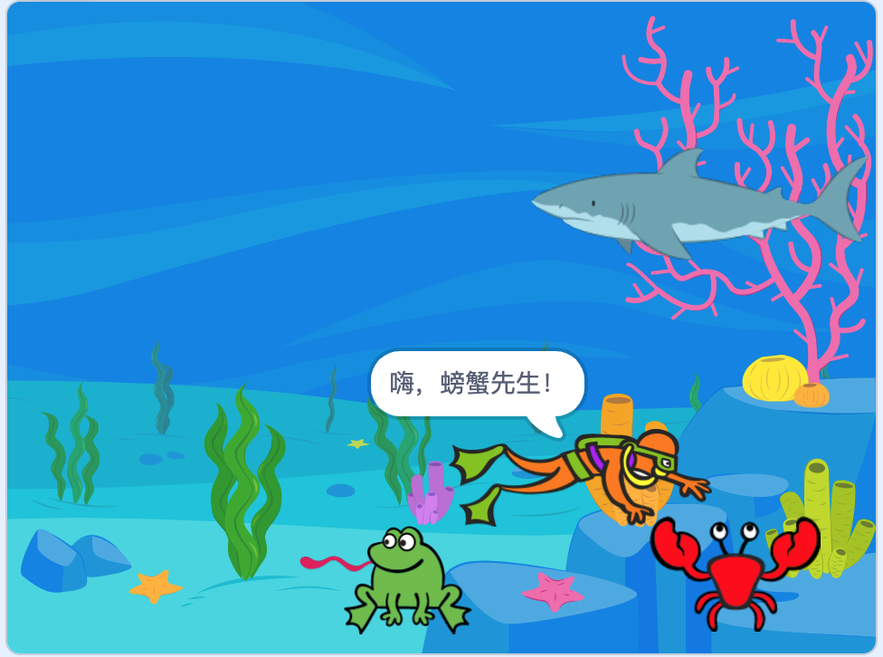

# 创建第一个Scratch游戏

> 让角色动起来。
>
> 有些角色可以在屏幕上随意移动，但大多数角色只能以某种固定方式位移。
>
> 本章中，你将了解角色的所有内容以及使他们移动起来的不同方法。

## 设置角色图

> 任何事物都需要有生存空间，而角色的生存空间就是在舞台上。
>
> 空间是二维的，也就是说角色只能上下左右移动。
>
> **角色在舞台上的位置：x变量，y变量和方向。**

### X坐标和Y坐标

> 每个角色都有一个特定的x变量和y变量，用来定位它的具体位置。

> 什么是变量？变量表示你不知道确切值或可能随时间变化的数字。
>
> 例如：你有多少个朋友？就是个变量，朋友的数量会根据不同的人而变化。
>
> 对于Scratch来说，角色的位置就是一个变量，因为角色在舞台上的位置决定这个变量的数值。

> 什么是坐标？
>
> > 坐标有两个数字，x变量和y变量，用来表示舞台上的位置。
> >
> > 
> >
> > X代表水平方向，Y代表垂直方向，
>
> Scratch中X的范围从-240到240；Y的范围从-180到180。

> 角色在舞台上从左向右移动，称之为水平方向，由x变量控制；
>
> 角色在舞台上从下向上移动，称之为垂直方向，由y变量控制；
>
> 因此，当一个角色左右移动时，它的x变量会改变；上下移动时，y变量会改变。

## 如何改变方向

> 就像每个角色都有x变量和y变量来告诉你它的位置一样，方向也有自己的方向变量。
>
> > Scratch采用与罗盘相同的方式表示方向，北方为0°。
> >
> > 
>
> 先了解表示方向的数字是什么意思？
>
> 角色的方向就像一个圆圈，当它面朝上时，方向数值是0。数字渐渐变大时，角色会按顺时针方向旋转，直到面朝下。

> 如果使用”面相方向__“积木块并单击该数字，就会看到一个带箭头的时钟，可以用来设置想要的方向。拖动箭头绕着时钟周围转圈就可以看到表示不同方向的数字。
>
> 

## 移动角色，从堆积积木开始

> 搞懂x变量和y变量后，就可以使用它们让角色动起来了。
>
> > 想让角色立即移动到新的位置吗？
> >
> > 想看它在舞台上滑行吗？
>
> 想如何移动角色将决定你应该使用哪种积木。

### 调整数值、进行设置和移动位置

> 要立即将角色移动到新位置，可以使用”将x坐标增加\_\_“积木或者”将x坐标设为__“积木来设置其x变量或y变量。
>
> 
>
> 更改选项卡会按你调整的距离移动角色，而设置选项卡会将角色瞬间移动到一个新的位置。无论选择哪个积木，角色都会立即出现在新位置上。
>
> > 小重点：将”将x坐标增加\_\_“视为移动多少步，将”将x坐标设为\__“视为”移到__“
>
> 同理可以设置y坐标。
>
> 有积木块可以同时设置x坐标和y坐标：
>
> 
>
> ”移到__“是另一个积木，可用于将角色移动到新位置。有几种选择：
>
> - 第一个是”随机位置“，随机将角色移动到舞台上的其他位置。
> - 第二个是”鼠标指针“。会把角色移动到鼠标所在的位置。
>
> 

### 滑行

> 角色不只能够从一个地方瞬间移动到另一个地方，还可以看着他们移动。使用积木”在\__秒内滑行道x:\_\_y:__“积木可以让角色在指定的秒数内从一点移动到另一个点。
>
> 角色最终会移到和你使用”移到x:\_\_y:__“相同的位置，但会显示出角色的移动过程，并且可以选定用多长时间让角色到达指定位置。
>
> 

### 该参观角色们的家咯

> ”金窝银窝不如自己的狗窝“
>
> 通常请情况下，最好在帽子积木后面就设置好角色的位置和方向。
>
> 

### 移动角色

> ”移动__步“积木能够让角色朝自己面对的方向移动数步。
>
> 如果角色面向右侧并移动10步，那么它的x坐标为10；
>
> 如果角色面朝上侧并移动10步，那么它的y坐标为10；
>
> 

## 朝方向移动

> 到目前为止，用来移动角色的积木刚刚令角色按自己面向的方向进行了移动。由于方向也是一个变量，因此你可以在移动角色之前，更改它所面向的方向。

### 设置角色的方向

> 如果确切知道自己希望角色要去的方向，请使用”面向方向__“积木。此处数字用来改变角色的方向，数值从-180到180.
>
> 有时候可能只是想稍微改变一下角色的方向。使用”右转\_\_度“和”左转__度“，积木会以顺时针或逆时针方向来改变角色的方向。
>
> > 例如：可以使用这些积木把游戏设置成：当玩家按左或右箭头时，就可以向左或向右转动汽车。
>
> 改变角色方向的最后一个积木是”面向__“积木。这个积木可以让角色面向舞台上的其他东西，此积木至少会有一个选项。
>
> 

### 设置旋转方式

> 有时可能希望角色能够在屏幕上以不同的方向移动，但又不想让它的朝向发生改变。
>
> > 例如：可能希望它向左看，但向上移动，这可以通过更改其旋转方式来完成此操作。使用”将旋转方式设为__“积木可以为每个角色设置不同的旋转方式。
>
> 将旋转方式设置为左右翻转：
>
> 
>
> 
>
> **将旋转方式设为任意旋转：**可以让角色自由地面向任何方向，请看旋转样式的实例。可以看到，每次角色移动时，它都会面向一个新的方向。
>
> 
>
> **将旋转方式设置为左右旋转：**则角色只可以面向左或右。此种情况下，当角色本来的方向哪怕只是略微向左或右时，它也将完全面向左侧（-90°）或正右侧（90°）。
>
> 
>
> **将旋转方式设置为不可旋转：**能让一个角色停止转动，方向设置变得无关紧要，角色将始终面向右侧。
>
> 

### 反弹

> ”移动__“步积木确实很棒，但是当你的角色到达舞台的边缘时会发生什么？就会卡在那里，这时就需要添加”碰到边缘就反弹“积木。
>
> 

### 运动变量

> 运动积木的底部，会发现有三个椭圆形的积木，这些是角色的运动变量。
>
> 
>
> 其中每个都有一个复选框，其数值会在舞台上显示。例如
>
> 
>
> > 有时需要在代码积木中使用这些变量。例如，也许游戏中有一个球从屏幕底部的球拍中弹回。要查看球员是否错过了球，可以检查球的y坐标变量是否小于球拍顶部的y坐标变量。

## 游戏——拜访朋友

### 选择有趣的背景

> 暂时先将Scratch猫删除掉。
>
> 
>
> 选择一个背景（还记得怎么选择背景吗？）：
>
> 

### 设置起来

> 添加一个主角色和几个其他角色，能够让主角色在海洋之旅中拜访其他角色。
>
> 按照自己的想法把每个角色拖到到起始位置。有些角色可能面向了错误的方向，也可能太大或太小。可以在角色区设置它们的大小和方向来进行调整。
>
> 
>
> 为了避免让角色颠倒过来，你还需要将旋转方式设置成”左右旋转“。
>
> 此游戏中，潜水员将到处游动，所以需要先添加一段积木代码，告诉他每次要从哪里开始。
>
> > 从”事件积木“中拖出”当绿色小旗被点击时“积木，然后把”移到x：\_\_y：__“积木与它连接在一起。

### 拜访朋友

> 要想让主要角色能够到处游动并拜访他的朋友。要做到这一点，可以将你的主角色（此例中是潜水员）拖到你希望他移动到的下一个位置，然后点击”在\_\_秒内滑行到x\_\_y__“积木，它将自动设置新位置的坐标。本例中滑行时间更改为了两秒，因此潜水员不会游动得太快。
>
> 
>
> 现在让你的主角色对他的第一位朋友说：”嗨“。你可以使用”说____秒“积木让这个游戏变得更有趣。
>
> 
>
> 
>
> 现在继续拜访下一位朋友。首先你必须将潜水员移到青蛙的上方，这样他就不会直接穿过青蛙来到螃蟹的旁边。将潜水员移到青蛙的上方并添加下一个”滑行“积木，如下图所示：
>
> 
>
> 
>
> 然后通过拖拽另一个”滑行“积木和”说“积木来移动潜水员，继续拜访小螃蟹。
>
> 
>
> 
>
> 最后，潜水员会遇到鲨鱼，但当他看到鲨鱼时会很害怕，钰时他想赶快游到舞台的其他地方，希望远离鲨鱼。
>
> 
>
> 

> 稍微优化一点？如下

> 动脑筋想一想，还能做什么使得这个项目更加完美吗？

