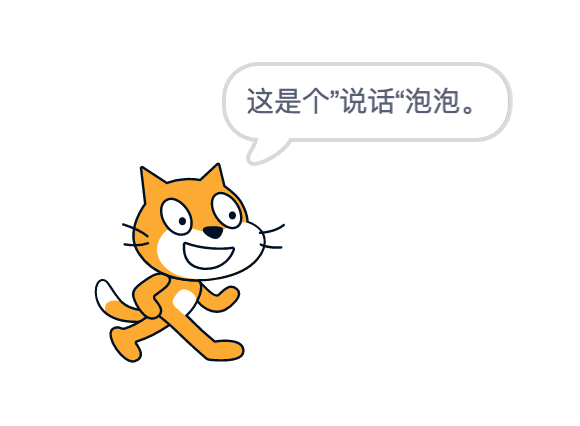

# 角色扮演——外观和动画

> 想想自己的样子，每天看起来都是一模一样吗？
>
> 在Scratch中，你也可以让角色的外观更好看。
>
> 使用外观积木可以更改背景、造型、颜色、角色说话的内容等等。
>
> 如果想让你的角色看起来更棒，你会想知道如何给它们做恰到好处的修整。
>
> 让我们一块了解一些可以改变游戏外观的不同积木把。

## 造型

> 第一章学习了一些关于造型的知识，以及如何使用”造型“选项卡做调整的方法。
>
> 接下来学习如何在脚本运行的状态下使用积木来更改造型吧。

> 每个角色都有一个或多个造型，每个造型都是不同的图片。
>
> 选中角色然后再单击屏幕顶部附近的”造型“选项卡，就可以看到该角色的所有造型。
>
> > 造型是显示角色的图片或图像。将角色设置为特定的造型时，舞台上就会显示该图像。
>
> 和造型相关的积木块：
>
> 
>
> 造型选项卡（巨嘴角为例）：
>
> 
>
> > 每个造型都有一个数字和一个名字，这是外观的两个变量。
> >
> > 每个角色都有自己独立的造型编号和名称变量，因为一个角色可能会有不同的造型。
>
> 下面是巨嘴鸟的三个不同的造型：
>
> 

> 利用积木块改变造型的一种方法是使用”换成__造型“积木，这种可以让你按照自己想要的方式切换造型。
>
> 如果不想让造型按特定顺序切换，则可以使用”下一个造型“积木。

## 背景

> 还可以获取很多背景，甚至可以像更换角色的造型一样改变背景。如下积木块可以更换背景：
>
> 
>
> 还有一个与其他有所不同的积木，也可以用来切换背景，”换成__背景并等待“积木。该积木经常与黄色事件积木部分中的一个积木一起使用，即”当背景换成\_\_“。
>
> ”换成__背景并等待“积木在更改背景后，会等待所有以”当背景换成\_\_“积木开头的代码完成后，再进入下一个积木。
>
> 
>
> 上图中还有一个用来改变背景外观变量的积木：”背景编号__“积木。它也有两个选项：编号和名称。单击此积木，它会告诉你已添加的背景数（编号）或已添加的背景名称（名称）。
>
> 

## 大小

> 通常情况下，Scratch中可供选择的角色大小总是一样的，这其实不符合实际情况，不是吗？
>
> 我们可以使用”将大小增加\_\_“积木和”将大小设为__%“积木来更改角色的大小。
>
> 
>
> 你可以把一个角色变得很大或者很小，但是不能让角色的大小为零，否则它就消失在舞台上！
>
> 如果想将角色恢复到正常大小，请将大小更改为100（100%），这通常是每个角色正常的尺寸。
>
> 每个角色都会记住它当前的大小，最后一个尺寸也会随游戏一起保存下来，也就是说，当你下次回来继续操作时，每个角色的大小都将跟你最后一次保存的保持一致。（可以通过查看角色区和”大小区“的数字来判断它的大小，还可以通过选中”大小区“外观变量旁边的复选框让角色的大小显示在舞台左上角。）
>
> 

## 显示和隐藏

> 有时候不想让角色立刻出现在游戏中，这时候”显示“和”隐藏“积木就派上用场了，可以让角色暂时出现或消失
>
> （暂时不需要的角色，或者角色穿越一个障碍，需要暂时消失）
>
> 需要注意的是：当将角色隐藏时，你对它所做的其他操作也会随之消失。（例如说的话等）
>
> 有时候某个角色，在游戏开始的时候不需要立刻出现，可以在单击绿色小旗后立即把这些角色隐藏，想让它们出现的时候再把它们放出来。

## 说与思考

> 角色是可以说话和思考的哟！我们可以将消息留给其他玩游戏的孩子，或者让自己的游戏更有趣！
>
> 可以使用两种不同的积木：”说\_\_“积木或”思考\_\_“积木，直到下一个”说\_\_“积木或”思考__“积木开始运行时，该积木才会消失。说与思考积木可以让角色在游戏过程中说出或思考一些内容！
>
> 
>
> 

> 如果希望自己的说话泡泡或思想泡泡在一定时间后消失，就可以使用”说\_\_\_\_秒“或”思考\_\___“积木。当设定的时间过后，这个泡泡将会消失。
>
> 

> 一个巧妙的技巧是让角色的说话泡泡出现，但将角色隐藏：将角色的”虚像效果“设置为100。如果不想让自己的角色出现，但仍想说话，就可以使用这种方法。例如，游戏结束的时候
>
> 

## 创建新外观

> 如果看了角色所有的造型后对外观仍不满意，该怎么办？
>
> Scratch还可以使用图形特效让角色看起来更加与众不同。（无论造型如何，图形特效都会改变整个角色的外观。）
>
> > 小提示：如果脚本中更改了角色的图形特效，最好在”绿色小旗“积木后面立马添加将特效清楚的设置。
>
> 
>
> 可以为角色添加许多非常酷炫的特效。利用”将\_\_特效增加到\_\_“积木和”将\_\_特效设定为\_\_“积木就可以做到。如果想删除所做的所有特效，请使用”清除图形特效积木 “。
>
> - 颜色
>
>   > 改变角色的颜色（具体的颜色可以试验）
>   >
>   > 
>
> - 鱼眼
>
>   > 此特效会让角色的中间部分看起来很大，其他部分看起来很小。特效的数值越大，角色的”气泡“特效就会越明显。特效达到150的样子如下：
>   >
>   > 
>
> - 旋涡
>
>   > 此特效会让角色看起来像是扭曲了一样，它会绕着中心点扭曲角色，是角色看起来像是在旋转。如下就是特效达到200时的样子（当然你可以使用更大的数字来获得更明显的旋涡特效）：
>   >
>   > 
>
> - 像素化
>
>   > 此特效会使得角色看起来更模糊。如下示例将像素化特效设置为20，数字越大就越模糊，也就越难知道它是谁：
>   >
>   > 
>
> - 马赛克
>
>   > 此特效可以让角色在同一地方变成许多个小角色，设置的数字越大副本就越多。如下是将”马赛克特效“设置为15时的情况。数字越大，副本越多
>   >
>   > 
>
> - 亮度
>
>   > 就像调整手机屏幕的亮度一样，可以调整角色的亮度。亮度越高，角色越亮。直到一切都编程亮白色，看下Scratch猫亮度特效为50的情况吧
>   >
>   > 
>
> - 虚像
>
>   > 此特效会让角色更加透明，也就是说可以更容易透过它看到其他内容，就像是透明的虚像。
>   >
>   > 尽管颜色是相同的，但是数值越大，透视性就越强。如下是特效达到50时候的状态：
>   >
>   > 
>
> - 特效组合
>
>   > Scratch并不是一次只能使用一种特效，你可以连续使用其中几个积木来创建一些非常酷的特效。例如可以组合使用颜色特效、马赛克特效、像素化特效。
>   >
>   > 
>
> - 动画特效
>
>   > 通过快速更改特效，可以创建带动画风格的特效。可以通过重复使用”将\_\_特效增加到__“积木来创建动画特效。
>   >
>   > 例子：如果按住空格键它将改变角色的像素化特效和虚像特效，这会形成慢慢像素化的特效，让角色慢慢变模糊，可以单击绿色小旗将其重置。
>   >
>   > 
>   >
>   > 此处的积木通过将角色的特效设为”像素化“和”虚像“来造成消失特效，是角色看起来活灵活现。

## 图层

> 当角色被彼此重叠时，就会以分层的形式出现。角色所在的图层靠前还是靠后决定了该角色是在其他角色的前面还是后面。

> 有时候可能找不到自己的角色，这很有可能是因为其他东西挡住了它！可以通过使用”移到最__“积木把它置于所有内容的前面。这样做就可以确保角色被看到了。
>
> 
>
> 如果想让一个角色位于几个角色前面但又在其他几个角色的后面，就可以使用”\_\___层“积木。可以设置直接把角色移到其他角色的后面或上面，而不是在最前或最后。

> 让我们以狮子、沙滩球和螃蟹三个角色为例，你能看出哪个角色在前面，哪个角色在后面吗？
>
> 
>
> 对沙滩球角色，使用”移到最后面“积木，球就会向最后移动。如果你想把一个角色藏在另一个角色的后面，那这个设置就非常有用。
>
> 

## 游戏——讲故事

> 在这个小游戏中，你需要讲述两个角色为生日派对做准备的故事。

1. 添加角色

   > 添加两个角色到舞台。你可以选择任意喜欢的两个角色（每个角色有两个以上的造型）。此处选择使用的是猫和猴子。
   >
   > > 小提示：选角色的时候，当把鼠标移动到要选择的角色上时，可以查看角色是否有多个造型。如果超过一个，不同的造型会来回切换。

2. 选择场景

   > 为派对场景选择一个背景。背景图片可以从现有的背景库中选取，也可以上传自己的图片。此处选择”巫婆的家“作为派对场景。

   

3. 开始对话

   > 让你的角色开始计划如何装饰派对。例如，可以让猫说”加几个气球怎么样？“然后猴子可以回到：”好主意！“
   >
   > 如果不想让他们同时说话，可以使用之前并未提到的积木”等待__秒“。此积木会在下一个积木运行之前等待几秒钟。

   > 猫角色的代码：
   >
   > 
   >
   > 猴子角色的代码：
   >
   > 

   > 猫角色的舞台效果：
   >
   > 
   >
   > 猴子角色的舞台效果：
   >
   > 

4. 添加气球

   > 如果想在猫和猴子的派对上加几个气球，你就必须再使用几个积木，以便让他们说完话后气球再出现。
   >
   > 当猴子说完话之后，气球就应该出现了。也就是说你需要在”换成__造型“积木之后添加”等待\_\_秒“积木。将时间设置为多少秒好呢？（猫说了两秒，猴子说了两秒，所以气球应该在四秒之后出现。）
   >
   > 只有一个气球的派对可不好玩哟。可以再增加几个，右键单击气球角色，选择”复制“两次。现在应该有三个气球了。
   >
   > 
   >
   > 将他们拖动到舞台上合适的位置，然后单击角色区中的每个气球并更改代码积木，让他们的造型各不相同，这样每个气球看起来就不一样了。

   > 三个气球的代码如下（区别是造型不同）：
   >
   > 

5. 把气球吹起来

   > 开始我们将气球的大小设为了原始大小的一半。然我们一块来把气球吹大吧!
   >
   > 首先，猫和猴子应该先说到气球。让我们再给Scratch添加几个”说\_\___秒“积木。

   > 猫角色的代码：
   >
   > 
   >
   > 猴子角色的代码：
   >
   > 

   > 猫的舞台效果：
   >
   > 
   >
   > 猴子的舞台效果：
   >
   > 

   > 现在必须让气球变大了。
   >
   > 首先，想等猫和猴子把话说完，所以应该添加另一个”等待__秒“积木，这次是五秒钟，然后再添加几个”将大小增加到\_\_“积木，并在两个”将大小增加\_\_“积木之间插入”等待\_\_秒“积木，这样气球就会变得越来越大。
   >
   > 三个气球的代码如下：
   >
   > 
   >
   > 最终舞台效果如下：
   >
   > 

6. 要跳舞咯！

   > 装饰派对已经做好了，你还可以通过改变猫和猴子的造型让他们做几个舞蹈的动作。
   >
   > 猫角色的代码：
   >
   > 
   >
   > 猴子角色的代码：
   >
   > 

> 大功告成咯！你刚刚与猫和猴子一起创造了一个很棒的小舞会哦。

> 所有需要的积木块已经设置完毕，单击绿色小旗，让所有角色动起来吧！

Let's Go!

