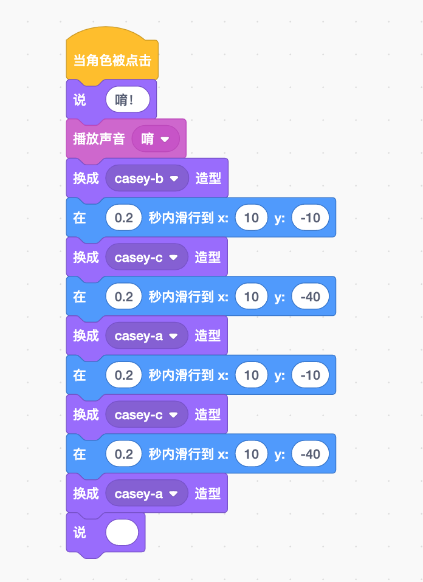

# 听起来不错哟——声音

> 想想你喜欢的游戏、电影和电视节目，他们是无声的吗？里面有人说话、有音乐，还有各种噪音！
>
> 所以制作游戏需要添加声音哦！

## 声音工作区

> 通过单击屏幕左上角的声音选项卡，可以找到声音工作区。在这里可以看到你所选择的当前角色或舞台的所有声音，还可以添加、删除或更改任何声音。其中的粉色框，在框内可以”看到“声音。（顶部波浪线距离底部波浪线越远，听到的声音就越大。）
>
> 

> Scratch里的许多角色其实已经拥有了自己的声音。例如，蛋糕角色带有生日快乐的音乐；Scratch猫会发出”瞄“的声音；舞台则附带默认的弹出声音。
>
> > 小重点：每个角色和舞台都拥有自己独立的声音组，因此当你在选择声音时，会注意到可用声音的列表会发生变化。

> 如果使用的是没有自己声音的角色，请不要忘记可以通过单击屏幕左上角的声音选项卡添加所需的声音。可以选择声音、录制自己的声音、选择随机的声音，或从你的计算机上传一个声音。

### 添加声音

> 为游戏添加声音的方法有三种：
>
> - 选择一个内置的声音
> - 录制自己的声音
> - 上传声音文件

> 进入声音库后，将鼠标移动到每个声音上，就能进行试听。单击选中的声音并将其添加到当前选定的角色或舞台上。
>
> 

> Scratch支持许多不同格式的声音文件。名称后缀带有MP3或WAV的文件基本上都可以上传使用。
>
> 如果计算机有可用的麦克风，也可以录制自己的声音。如下为我自己录制的声音（大家好）：
>
> 

### 编辑声音

> 还可以对声音进行编辑。
>
> 该框表示播放时声音的音量，左侧是声音的开始部分，右侧是结束部分，这能帮你”看到“声音。
>
> 声音播放时，通过自己观察就可以看到其他部分从开始到结束是什么样的声音，这可以帮你选择要调整的部分。
>
> 上方的编辑区可以允许你修改声音的名称或截取部分声音。点击后会看到两个红条，能够左右移动。两个红线之间的内容会被删除，其他部分会被保留。通过这种方式可以根据需要缩减声音，从而获得自己想要的声音。（需要不断的尝试）
>
> 

> 你还可以将声音变形，例如修改的快一点、慢一点、响一些、或低一些等；使其机械化；甚至可以翻转播放；（后续会逐步学到，学之前自己可以先尝试一下。）这些调整还可以相互组合，搞乱了也不用担心，有”撤销“或者”重做“按钮。

> 小提示：许多角色已配有属于自己的声音了。

## 声音指令

> 到此为止，我们已经学会如何添加和编辑声音了，那么现在就是时候了解不同的声音积木啦！用这些积木可以做很多有趣的事情哦。（可以用来播放搞笑的声音，甚至可以弄出像老鼠一样吱吱叫的声响！）

> 扩展：音乐扩展中还有一些更高级的积木，比如演奏乐器和加速声音。不过现在我们还是先专注于学习核心的声音积木，等学完后续的音乐积木课程时，就能熟练地掌握和使用他们了。

## 播放声音——有趣的部分

> 开始使用声音最简单的办法是添加”播放声音__“积木或”播放声音\_\_等待播完“积木。
>
> 
>
> 这两个积木非常像，他们都会播放声音哦！
>
> 区别是：”播放声音__“只是启动声音，然后立即进入下一个积木。如果下一个积木也是声音积木，那么两个声音的播放是重合的。
>
> ”播放声音__等待播完“积木会在进入下一个积木之前放完整个声音。

> 举个例子：试着将下图中的积木添加到游戏中的角色上。然后听一下（其他的声音也可以）：
>
> 
>
> 你应该听到第一个积木播放”生日快乐“，直到播放完，下一个积木”播放大家好“，才开始播放，但不等他播放完，在下一个积木”播放声音瞄“会立刻响起，而且几乎是在同一时刻发生的。

> 有时你会想持续播放一段时间很长的声音，就像播放背景音乐一样。但是当Scratch进行完当前的一组积木后，你又不希望音乐再继续播放下去了，”停止所有声音“积木就可以派上用场了，他会停止正在播放的所有声音并移动到下一个积木（如果有的话）
>
> 

## 小点声哦！

> 就像每个角色都有一个x变量和一个y变量一样，每个角色和舞台都有一个当前的声音变量，叫做”音量“。
>
> 在声音积木下面，你会看到一个写着”音量“的椭圆形积木，旁边还有一个白色复选框。单击复选框，就可以看到该角色或舞台的音量。
>
> 

> 声音选项卡下面的声音编辑器界面，通过单击”响一点“和”轻一点“按钮，你可以让声音变大或变小。可以”看到“声音的大小变化。
>
> 如果不想让声音按照系统设定的幅度变化，还可以使用”将音量增加__“积木和”将音量设为\_\_“积木来调节音量。使用这些积木时，它们会在你运行代码积木后才对声音进行调整。
>
> 

### 改变音效

> 还可以在Scratch中制作自己的音效哟！可以添加许多不同的特效来制作炫酷的新声音。

> > 小知识：音调是指声音的高低。如果你提高声音的”音调音效“，它就会越来越像老鼠的尖叫。随着音调的提高，声音也会播放得更快。如果把音调降低，声音会越来越低沉，还会放慢速度，使播放的时间更长。

> 与其他积木一样，你可以调整或设置所使用的特效强度。（这些调整不会像你在声音编辑器中所做的调整那样可以对对声音做永久性改变。）
>
> ”将__音效增加\_\_“积木可以使音调更高或更低，使其他特效强度更强或更弱；
>
> ”将__音效设为\_\_“积木会把音高或其他特效设到特定值。
>
> 
>
> 试试示例中的这些积木，它们每次都会把音调提高20。当你点击绿色小旗时，就会听到声音变得越来越高！如果你想把它降低，请将20改为-20。
>
> 

> 使用”左右平衡“也可以得到相同的效果。较高的数值会使声音向右扬声器靠近；相反，较低的数字使声音听起来像是从左扬声器发出的。（除非你有两个相距很远的扬声器或者你正在使用耳机，否则将感受不到这种效果。）
>
> 

> 如果想把之前用声音积木进行调整的声音变会最初的状态，可以使用”清除音效“积木。此积木将消除声音积木的所有音效，让声音变会初始状态。但该积木不会消除你在声音编辑器中所做的任何调整。
>
> 

> 声音编辑器中，可以使用不同音效对声音进行永久性更改。如下列表
>
> 
>
> - 快一点/慢一点：这两个会让声音变得更尖锐（音调更高）或更低沉（音调更低），但不会对音量产生影响。
> - 机械化：这会让声音变得就像机器人在说话一样。
> - 响一点/轻一点：这会把声音的音量调高或降低。
> - 反转：这会让声音反向播放。
> - 静音：完全不出声
> - 渐强/渐弱：逐渐增强/逐渐渐弱

## 游戏——音乐派对

> 在这个游戏中，我们将认识几个新的角色，他们还可以发出不同的声音。

1. 开启背景音乐

   > 向往常一样，首先添加背景。搞一个音乐派对，所以来选择派对背景吧。现在还需要添加一个带声音的角色。
   >
   > 

   > 添加键盘角色并且转到该角色的声音选项卡，为键盘添加声音。这样背景音乐就有了。其中有一个"舞蹈声音"，比较适合这里。
   >
   > 

   > 点击键盘角色时播放音乐。当你第一次点击绿色小旗开始游戏，并不希望音乐声音太大，可以试试在一开始就使用”将音量设为__%“积木来控制音量。

   > 如果想改变键盘角色的造型，让它从图像上就能看出是在播放的样子，将造型改为”键盘-b“，这样看起来就好像真的在发出声音。

   > 添加一个声音积木，这样它就可以播放音乐了。如果想在进入下一个积木之前播放整个音乐，所以你想用的是”播放声音__等待播完“积木。

   

   > 如果要在歌曲中间改变音调，该怎么办？可以添加一个目前为止还没见过的黄色事件积木，叫做”当角色被点击“，但你点击键盘时，积木就会启动。把”将音调音效增加__“积木添加到该积木下面，就可以随时把音乐的音调调高咯！
   >
   > 

2. 添加其他声音

   > 如果再添加几个带声音的角色，那听起来就更棒啦。可以添加一个鼓（drum-highhat）和一个钹（drum-cymbal）。
   >
   > 现在添加”换成造型__“积木和”播放声音\_\_等待播完“积木，就像之前为键盘添加积木那样，不过这次不需要改变音量。
   >
   > 你想在点击它们的时候再启动声音，那就是用”当角色被点击“的帽子积木，而不是”当绿色小旗被点击“积木。

   > 高帽鼓的代码：
   >
   > 
   >
   > 跋的代码：
   >
   > 

3. 添加鼓手

   > 只有鼓的话看起来会有点奇怪，可以给它加一个鼓手哟，比如凯西。你想让他站在鼓的最后面，所以应该使用”移到最后面“积木。
   >
   > 

4. 录制声音

   > 当其他角色都在发出声音的时候，可不能让凯西静静地站着，什么话都不说。那怎么办呢？为凯西录个声音吧，比如”唷！“，别忘了把你的录音重命名为”唷！“，再加上一些积木，让凯西边跳边说”唷！“，别忘了在最后添加一个空白的”说__“积木，这样他就不再说了。你制作的积木看起来是图上显示的这样的吗？
   >
   > 
   >
   > 为了让凯西多跳几次，你可以增加循环控制积木如下（这样当你点击凯西角色的时候，凯西会循环跳舞三次）：
   >
   > 

5. 更换音乐

   > 如果想跟换背景音乐该怎么办呢？你可以添加另一个角色并为它选取一些不同的音乐来播放！
   >
   > 当点击绿色小旗时，将会设置蛋糕的造型，因此蜡烛一开始并没有点亮。然后，当你点击蛋糕时，其他声音都将停止，生日快乐歌响起的同时蜡烛也亮了起来。
   >
   > 

6. 停止音乐

   > 最后，你还要想办法停止所有的音乐。添加一个可以让所有音乐都停下来的角色，比如Button5，大X按钮等角色。
   >
   > 这个积木比较简单，你只需要用到”当角色被点击“积木和“停止所有声音”积木。
   >
   > 现在，当你点击X按钮时，音乐将会停止，键盘角色会切换到最初的造型！
   >
   > 

Let's Go!