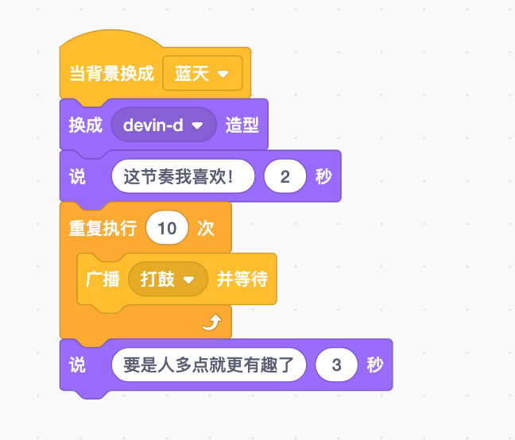

# 事件改变世界——事件指令

> 事件随时随地发生。有时，事件是为了展开有趣的事情，比如奥运会的开幕式；有时是为了庆祝某些事情，比如生日派对；有时只是为了告诉很多人一些重要的事情，比如学校的会议；
>
> Scratch中的事件和这些事件一样，有些事件积木可以开启游戏；有些事件积木是为了庆祝某些事情；有些事件积木告诉其他积木一些重要的事情。
>
> 让我们来一起了解一下这些事件积木吧！

## 了解事件

> 就像现实生活中发生的事件一样，Scratch事件也会随时发生。与现实世界中很多事情不同，Scratch中的事件是可以控制的。
>
> 例如：如果你将“当绿色小旗被点击时”积木放在另一个积木的上面，那么只有在单击绿色小旗时，才会启动该积木。如果没人点击，那么什么也不会发生。
>
> **Scratch中的所有事件都是这样的——你必须做些什么事情才能让事件发生。**

> 现在来看几个黄色积木吧。
>
> 你应该注意到这些积木看起来有点不同了吧，这些具有特殊形状的积木叫做帽子积木，是用来开展事件的。
>
> > 帽子积木是让你用来开始事件的积木。
>
> 

> 如果你在没有帽子积木的情况下将代码积木放入工作区，那么可以让这些积木执行任何操作的唯一方法就是单击它们，否则它们只会待在那里什么都不做。

> 你可以使用帽子积木在恰当的时候开启所有内容。Scratch中的事件积木都是以“当”开头的，当Scratch中发生一个事件时，你的事件积木将开始运行代码积木，让角色按你的想法行动。

> Scratch中有两种不同类型的事件：
>
> - 一种是事件来自于外部，有人告诉游戏该做什么。例如，玩家按一下向上箭头键来让角色向上跳。
> - 另一种事件称为内部事件，是由你创建的事件。例如，“当背景换成__事件”。该事件由游戏内的其他积木切换背景引起，而不是由玩家控制。

## 外部事件

> 如何让电脑做不同的事情呢？最常见的方法是用鼠标和键盘。你可以移动鼠标并单击，或者按键盘上的按键。在Scratch中，你可以将积木连接在一起，当玩家按下某个键或用鼠标点击时，就能执行操作，这些叫做外部事件。

> Scratch中可以使用的外部事件不止一种，例如“当绿色小旗被点击时”事件积木。以下是开启外部事件后可能发生的所有不同事情。
>
> - 当绿色小旗被点击时
>
>   
>
> - 某个键被按下时
>
>   
>
> - 角色被点击时
>
>   
>
> - 当背景被换成时
>
>   
>
> - 自按下绿色小旗，计时器达到一定的秒数，或响度（来自麦克风的声音）超过一定限度时。
>
>   
>
> - 使用摄像头时，视频运动数值超过一定限度时。这一项要比其他的更先进，我们可以在后续章节学习。
>
>   

> 可能看到上述信息就能搞明白了这些积木是如何工作的了！
>
> 当按下绿色小旗时，“当绿色小旗被点击”积木将启动它下方的积木；当你按下空格键（或其他任何你想用的键），该键将启动其下方的积木，依次类推。“当计时器>10”积木可以帮你将某些事情的发生延迟数秒。
>
> 也许你想让你的角色在十秒后出现在舞台上，然后说“你好！”，这时你就可以使用下面的积木来实现。
>
> 
>
> > 小重点：请注意，当单击绿色小旗时需要将角色隐藏，这样你就不会立即看到它了。

## 内部事件

> 可以让事件按照自己的想法发生，而不是玩游戏的人按下按钮，这种叫做内部事件，你可以使用其他积木来让这些事件发生。
>
> 了解内部事件的最佳方式是要先知道为什么需要一个内部事件。

> 想象一个场景，舞台上有两个角色。每个角色都有自己的积木来让自己做事情，但他们不知道其他角色会做什么。如果你想让他们同时做一些事情，这里有两种选择：
>
> - 可以添加事件让他们在恰当的时间做事情，就像你在“讲故事”那个活动中猫和猴子做的那样。
> - 你还可以创建一个内部事件，这样其中一个角色就会告诉另一个角色做什么。

> 内部事件的帽子积木有两个：“当背景换成\_\_”和“当接收到__”。“当背景换成\_\_”积木会完全按照它说的做。如果你使用“换成\_\_背景”外观积木更改背景，那么所有与“当背景换成\_\_”积木连接的积木都将开始运行。
>
> 
>
> “当接收到__”积木在做事情前，会等待“广播\_\_”积木或“广播\_\_并等待”积木先运行。这两个积木是用来发送和接收消息的，此消息只是事件的名称，可以随意进行命名。
>
> 

> 事件消息与“说__”积木或“思考\_\_”积木不同，后者显示的是不同类型的消息，事件消息在舞台上是看不到的。一个角色将事件消息发给另一个角色并告诉它该做什么。

> 下面这些积木还可以帮你创建新消息。可以根据需要给新消息命名。
>
> 

> > 小重点：不要将消息与角色的说话泡泡搞混淆哦。角色的“说”积木和“思考”积木会让它们把说话泡泡和思考泡泡展现出来。消息是根本不会在舞台显示的，因此你永远不会真正看到这些消息。

### 用信息来安排事情的时间

> 信息真正有用的地方在于两个角色互相交谈时。谁也不想在每次进入下一部分时，都必须按下键盘或单击按钮。不过，让一个角色知道另一个角色正在跟他说话是可以实现的哟！

> 例子：艾弗里想看女演员贝基跳支舞。在艾弗里问：“我能看你跳支舞吗？”之后，“广播问完跳舞”积木将想贝基发送“问完跳舞”的消息。如果贝基的积木以“当接收到问完跳舞”的帽子积木开始，当艾弗里播放这条消息时，贝基会说：“当然可以啦”，然后将通过改变12次造型来完成这段舞蹈。跳完舞蹈之后，她的脚本会把“芭蕾舞跳完”的消息发回给艾弗里。这让艾弗里知道是时候说“谢谢！”了。

> 

> “广播__”积木和“当接收到\_\_”积木一起工作才能让两个角色知道其中一个角色想让另一个角色做某件事情。

> 消息这部分一旦学会了，真的可以让你的游戏变得很棒哟！

### 广播和等待

> 还有一个积木“广播__并等待”积木。
>
> 
>
> 直到收到消息的所有积木都完成操作以后，此积木后面的所有积木才会启动。如果你想让有些积木在其他事情发生后不再继续下去，这时候用该积木就可以轻松搞定了。

> 有了这个积木，上面的例子可以优化一下喽，你会优化吗？
>
> 

> 但是要小心使用这个积木。如果接收到消息的积木永远不会完成，则接收后的积木也永远不会发生。
>
> 如果再贝基的积木中添加一个“重复执行”的积木（注意没有重复次数）那么艾弗里说“谢谢！”积木的最后一条消息将永远不会发生。
>
> 如下：
>
> 

##  并行事件

> 有时候可以同时启动多个脚本。这时候可以使用并行事件，或让两件事情同时发生。

> 下面脚本为例，如果它们用的是同一个角色，当点击角色时，他会说三个说话泡泡，同时还会跳舞。
>
> 

## 游戏——开心舞会

> 现在已经知道如何控制事件发生的时间了，接下来让我们用不同的场景来创作一个故事吧。
>
> 在活动中，你将讲述一个故事，故事中讲述一个男孩儿打鼓的故事。过程中，他会找一个朋友一起玩儿，并邀请他伴着音乐一起跳舞。

> 聚光灯背景：
>
> 

### 设置背景

> 此游戏需要三个不同的场景。首先，男孩儿必须找到一个朋友；接下来开始打鼓；然后每个人都跳起舞来。

> 首先需要添加三个不同的背景，一个场景用一个。
>
> 在男孩练习时使用蓝天背景；在他找到朋友后使用派对背景；主要的活动使用聚光灯背景。
>
> 

> 接下来，要确保背景按照你的想法切换，这听起来像个事件哟！确保你己经选择能够添加积木的背景了，应该会以蓝色边框突出显示哦，如上图所示。

> 你需要使用一个事件帽子积木来启动，因此，请选择“当绿色小旗被点击时”积木。
>
> 现在还需要添加一些“外观”积木，以便在需要时更改背景。你想在背景变化后运行其他积木，所以选择“换成__背景并等待”积木。

> 你是怎么做的呢？完全跟着顺序做的吗？如果你已经做到这一步了，那你的积木应该是这样的：
>
> 

### 选择角色

> 是时候选择角色啦。
>
> 在第一个场景中，男孩儿开始表演打鼓。也就是说需要一个男孩儿的角色和一个鼓的角色。
>
> 根据示例选取角色Devin和架子鼓。

> 现在要让Devin开始打鼓啦。首先，将Devin改成“Devin-d”造型，这个造型会让他看起来像是准备要打鼓了。

> 现在你想让他说“这节奏我喜欢！”所以，添加一个“说__\_\_秒”积木，然后填写。
>
> 此处使用“重复执行”积木（此积木将在后续了解更多），该积木可以让“广播__并等待”积木重复10次，这样就能听到10下鼓声了。
>
> 打完10下后，Devin就会说“要是人多点就更有趣了”，而这就是这组积木中的最后一个，如下：
>
> 

### 打节奏

> 等一下！目前还没有能播放出声音的积木呢。你需要在架子鼓上添加积木，让它在每次收到广播消息时就播放鼓声。你觉得要怎么做呢？
>
> 
>
> 鼓手在打鼓的时候，手可不能保持不动，所以让Devin的手动起来吧！每次鼓声响起时，你都可以更换Devin的造型，让他看起来像是击中了鼓。当Devin收到“打鼓”的消息时，就会立即更换造型，等待0.2秒后再切换回来。（在Devin的角色下编程）
>
> 

> 我们还可以更换架子鼓的造型，这样看起来就像是架子鼓在演奏音乐，就像给Devin所做的设置一样。
>
> 

### 找朋友

> 现在要转移到第二个场景咯。首先，你需要找一个朋友来跳舞，所以进入角色库帮Devin找一个朋友。我们找了八爪鱼奥特（其他具有不同造型的角色都可以），不想让八爪鱼奥特在第一个场景中出现，所以先把他隐藏起来，到第二个场景再让它出来。
>
> 

> 因为后面还需要让八爪鱼奥特到处移动，所以先确保它第一次出现在恰当的地方。所以先将它移动到一个位置，然后添加“移到x：__y：\_\_”积木，接着在下面添加一个“显示”积木，让它能够按时出现！

### 换成派对背景

> 看到八爪鱼奥特，Devin多少会有些惊讶。毕竟是章鱼嘛！
>
> 当奥特出现的时候，让Devin先跟它打个招呼。奥特什么时候出现呢？答案是当背景切换到派对时。因此，应该使用“当背景换成派对”积木启动此代码。
>
> 为Devin添加一个“说__”积木来询问“你是谁呀？”当Devin问问题时，你想让奥特进行回答，所以Devin应该广播一条消息给奥特，这样奥特就能进行自我介绍了。在此之后，让Devin说：“我有好听的音乐哦”并再次播出“打鼓”信息。
>
> 
>
> 八爪鱼奥特来回应Devin的消息。添加一个“当接收到介绍暗示”帽子积木，然后添加“说__\_\_秒”积木。现在写一条消息，以便奥特向Devin介绍自己。
>
> 

> 每当奥特收到“打鼓”信息时，你都要改变它的造型，这样它看起来就像正在跳舞。也就是说你需要从另一个“当接收到__\_\_”积木开始，然后使用“换成\_\_\_\_造型”积木。在这种情况下，奥特应该从“章鱼-b”造型切换到“章鱼-a”造型。现在，应该看到，当Devin在打鼓时，奥特在跳舞。
>
> 

### 更换舞台背景

> 当Devin打完鼓后，背景积木将切换到最后一个背景“舞台”。背景改变后他再次演奏，并说“主要节目要登场咯”。
>
> 最后，他还应该告诉奥特很高兴能为他伴奏！
>
> 

Let's Go!

