# 运算把你我联结在一起——运算

> 想想你的数学课，你都学些什么呢？加法、减法、乘法和除法等！
>
> 这些都被称作运算，你也可以使用代码进行数学运算哦。
>
> 接下来我们就在Scratch中学习如何使用运算，这样就可以执行正确的操作来达到自己的目的啦。

## 到底什么是运算指令呢？

> 你可能听说过把两个数字加起来称为加法，把两个数字拆开称为减法。加法和减法都称为运算，你在这些运算中使用的符号（如"+"和"-"）称为运算积木。

> 加法至少需要两个数字来相加，因为添加一个数字是根本没有意义的！但在一些运算积木中，例如“四舍五入__”只需要添加一个数字。

> 运算积木可以根据它们可以执行的操作类型组合在一起。了解这些组合非常重要，这样你才能正确使用。
>
> 我们要学习的第一组运算积木是你的数学运算。
>
> 接下来我们开始吧！

## 数学运算

> 当你需要在Scratch中进行一些数学运算时，数学运算积木就能帮到你了。简单的数学运算积木有加、减、乘、除积木，顾名思义，这就是用来计算加减乘除的积木。
>
> 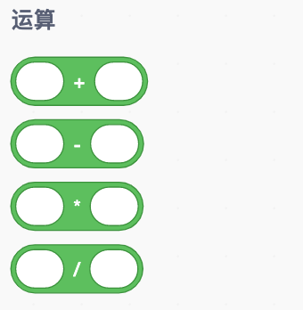
>
> 这些运算积木也称为报告积木，就像学校的成绩单一样，它们告诉你（或它们所在的任一积木）它们所计算的数字。如果单击其中一个数学运算积木，它们本身并不会出现任何其他积木来报告这个数字，只会显示在一个小泡泡中。
>
> 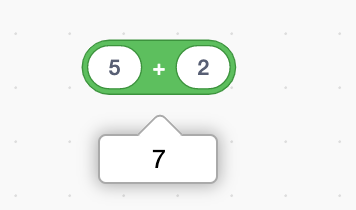
>
> 如果你想直接看到答案而不必每次都要点击，可以把运算积木放在一个“说__”积木中，让角色说出答案。
>
> 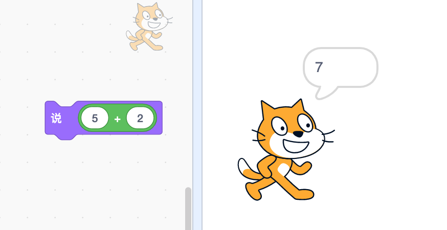

> 并不是只能使用一个运算积木哦，这些积木可以组合或堆叠在一起来创建更长的操作。例如你想算出2*3*4等于多少，可以将一个运算积木放在另一个运算积木中。如下
>
> 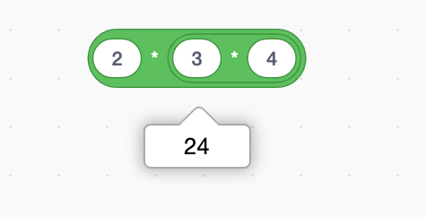
>
> 可能你在学校中已经学过做数学运算的某种顺序，如果不按顺序进行，可能会产生不同的答案哦。
>
> **先算括号里面的，其次算指数，然后算乘法和除法，最后算加减。**
>
> 当你将积木堆叠在一起时，Scratch会按顺序完成运算。堆叠积木的方式将决定执行运算操作的顺序。
>
> 例如：
>
> 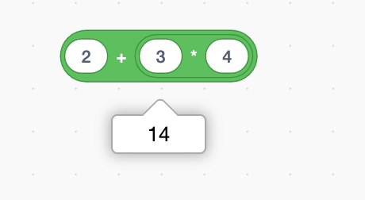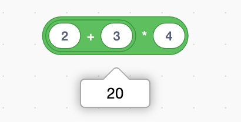

> 除了四个普通的数学运算积木之外，还有几个其他的。“四舍五入__”运算积木会把数字的计算结果约等成整数。也就是说，它得出的结果不带小数部分。
>
> 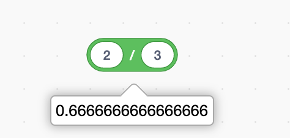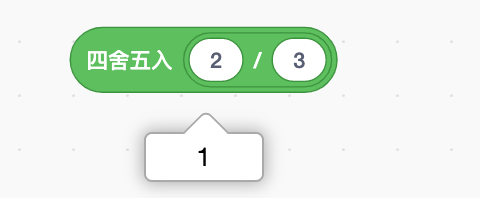
>
> 当使用侦测积木或其他不需要小数的运算积木时，“四舍五入__”运算积木就非常有用。例如，如果你将“计时器”放在“四舍五入\_\_”积木内，它将按秒数计数，不会显示疯狂变化的那部分小数。
>
> 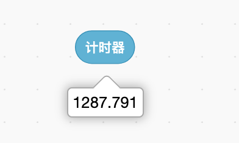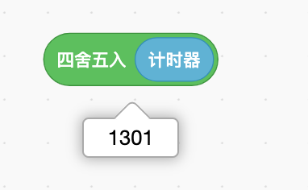

> 当玩游戏时，可能已经注意到有些怪物是随机出现的。它们似乎在寻找攻击方式，但不会直接去攻击你，只会朝不同的方向来回移动。“在__和\_\_之间取随机数“积木就可以让你的角色做同样的事情。
>
> 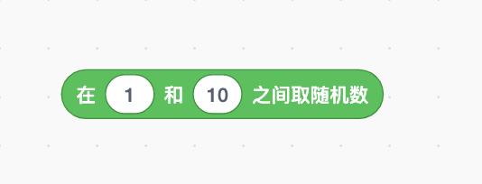
>
> 我们可以把东西放在随机的地方，让它们随机出现，等等。这是Scratch中最有用的积木之一，可以让游戏更具挑战性，更加有趣。
>
> 如果需要一个包含小数的随机数，该怎么办呢？”在__和\_\_之间取随机数“积木也可以取随机小数，需要做的就是在积木中加一个小数。例如，如果要获得0到1之间的小数，只需要在积木中使用”0.0到1.0之间取随机数“即可。
>
> 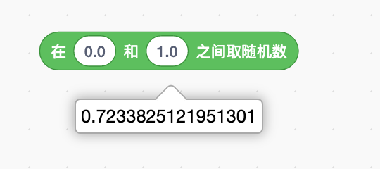

### 高级的运算积木

> 现在你已经了解了一些简单的数学积木，让我们了解一些难点的。
>
> ”__除以\_\_的余数“积木会告诉你两个数字相除，剩余的部分是多少。例如，如果使用”5除以2的余数“的积木，答案即为1。
>
> 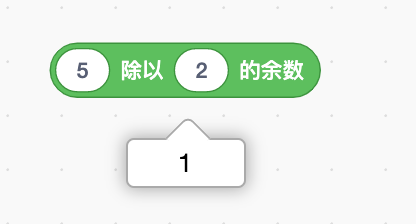
>
> 当需要将事物分组时，”__除以\_\_的余数“积木会非常有用。”余数“功能可以帮助你计算出剩余的部分。

> ”__的\_\_“运算积木是一个非常强大的积木，可以运算许多高级数学函数。此积木有许多不同的操作列表项。
>
> 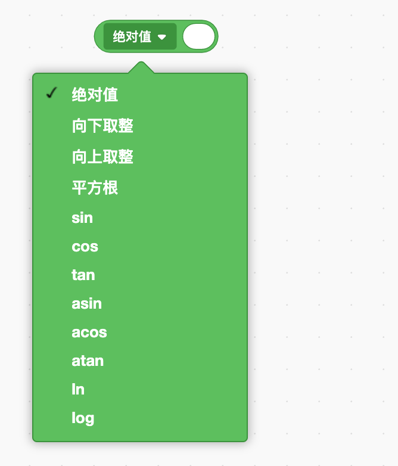

| 运算                                                         | 作用                                     | 示例                                                         | 游戏示例                                                     |
| ------------------------------------------------------------ | ---------------------------------------- | ------------------------------------------------------------ | ------------------------------------------------------------ |
| 绝对值                                                       | 数字的绝对值；将负数转为正数；           | ”绝对值-3“=3 ”绝对值3“=3                                | 计算出角色离舞台中心的距离                                   |
| 向下取整                                                     | 无论小数是多少都直接舍去                 | ”向下取整2.35“=2 ”向下取整0.99“=0 ”向下取整-1.5“=-2 | 取整的用途有很多                                             |
| 向上取整                                                     | 无论小数是多少都直接进一                 | ”向上取整2.35“=3 ”向上取整0.99“=1 ”向上取整-1.5“=-1 | 取整的用途有很多                                             |
| 平方根                                                       | 计算数字的平方根                         | ”平方根4“=2 ”平方根3“=1.732                             | 计算两点间的距离                                             |
| sin（正弦函数） cos（余弦函数） tan（正切函数） asin（反正弦函数） acos（反余弦函数） atan（反正切函数） | 用于计算角度的三角函数（高一年级会学到） | ”tan45“=1 ”atan1“=45° ”cos30“=0.866 ”acos0.866“=30° | 绘制曲线或计算下落物体的轨迹                                 |
| ln（以e为底的对数）                                          | 自然对数                                 | ”ln7.389“=2 ”ln2.718“=1 ”ln1“=0                    | 帮助计算问题生长所需的时间                                   |
| log（对数）                                                  | 以10为底的对数                           | ”log100“=2 ”log1“=0                                     | 有时你想把大数字缩小后纳入相同的范围内。例如，使用对数可以把0到1000纳入到0到3的范围内。 |
| e^（e的N次方）                                               | 一段时间内的增长量                       | ”e^2“=7.389 "e^1"=2.718                                 | 计算物体的增长速度                                           |
| 10^（10的N次方）                                             | 10的N次幂                                | ”10^2“=100 "10^5"=100000                                | 当你使用非常非常大的数字时，能够用到                         |

## 条件运算

> 跟数字有关的已经学的差不多了。还有其他类型的运算积木，其中一种就是条件运算积木，来吧，一起学习下！
>
> 条件运算积木在Scratch中显现为绿色六边形积木。有时也称为布尔运算积木，这说起来真的很有趣。这些积木一般只报告两件事中的一个，即某事是是还是否。

> 有两种不同类型的条件运算积木：一种是使用数字和单词，还有一种与其他条件运算积木一起使用。

### 比较条件运算积木

> 使用数字和单词的三个条件运算积木称为比较条件运算符。第一个积木询问第一个数字是否小于第二个数字；第二个积木检查两个数字是否相等；第三个积木检查第一个数字是否大于第二个数字。
>
> 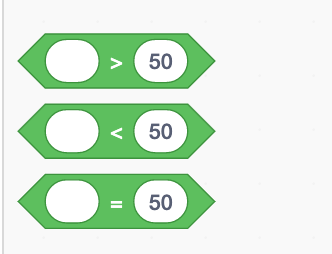

> 虽然看起来这些积木只适用于数字，但你也可以用来比较单词。当想知道变量是否正确时，这个积木可能就会很有用。
>
> 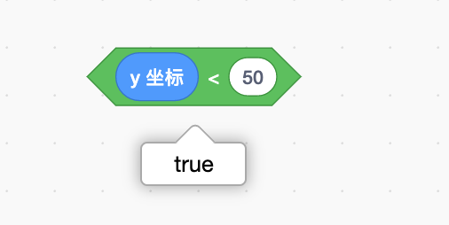

> 示例：在运行”如果/那么“积木之前，这个条件比较积木会检查龙角色的造型目前是否是”龙-c“。这里的”如果/那么“积木使用运算符来决定是否运行自己积木内的”思考__\_\_秒“积木。
>
> 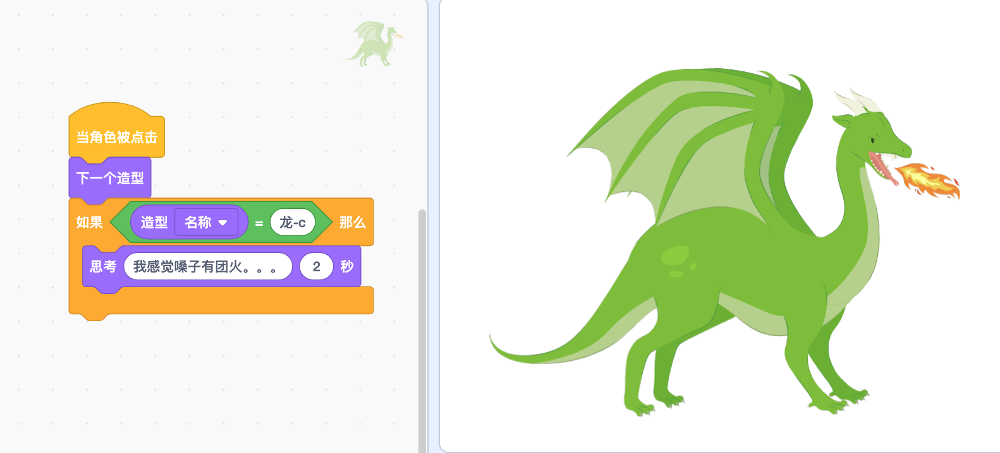
>
> 注意：Scratch会忽略字母的大小写，并将它们保持一致。也就是说：A与a是一样的。
>
> 此处和Python和JavaScript有区别哦。

> 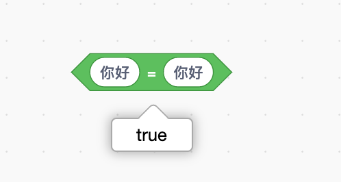

> 你还可以使用比较条件运算积木按字母顺序对字符进行排序。这种情况下，cat没有dog大哦！单词cat以c开头，因此它会出现在（或小于）单词dog之前。
>
> 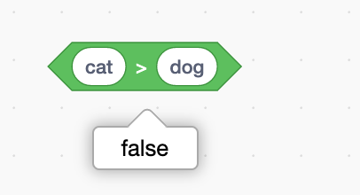
>
> 但是猫比狗大，因为mao中的m比gou中的g大。
>
> 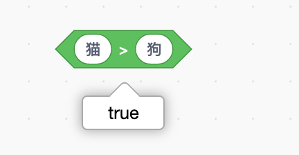

### 逻辑运算积木

> 目前为止，你学了可以使用数字和单词的条件运算积木。不过，还有三个条件运算积木只能与其他条件运算积木一起使用。他们被称为逻辑运算积木，如下：
>
> 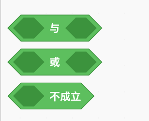
>
> 

## 单词游戏

> 

## 游戏——数学版危险边缘

> 

Let's Go!