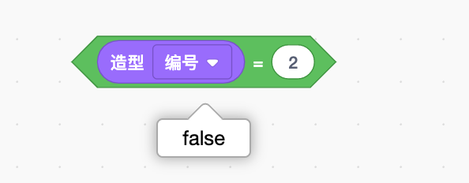

# 控制流程——控制

> 在网上或现实生活中玩过有藏宝图的游戏吗？
>
> 你必须按照指示，转几次弯，通过几个障碍物才能找到正确的路，还要根据地图的要求做出很多决定。
>
> 在Scratch中，控制积木可以让你的角色根据游戏中发生的事情做出决定。
>
> 除了最简单的游戏之外，其他游戏都需要用到该积木。
>
> 角色需要能够在许多不同条件下或在某些情况发生时提前考虑你希望他们怎么做，要控制这些，需要添加能为你的角色提供方向的积木。
>
> 控制积木就是用来完成这种要求的。

## 条件指令

> 你有没有请求父母或者爷爷奶奶做些事情，他们说“好，但有一个条件”？为了得到你想要的，就必须按照他们的要求去做。可能让你打扫完自己的卧室，他们才允许你去朋友家；可能为了吃冰激凌，不得不把蔬菜吃完。

> 在创建游戏时，你经常会发现有一组积木，仅在一种情况下使用。例如你想在计时器数完秒后或玩家按向上箭头键后积木才开始运行。这是使用条件积木的好时机，该积木只在其他事情发生时运行。接下来会使用许多新的有趣的条件积木，而且每种情况都会有所不同。
>
> 学习这些不同的积木能够帮你了解在不同情况下该使用哪个积木。

> 有些控制积木需要添加六边形积木，你所添加的六边形积木称为条件。条件是是或否（有时是真或假）。例如，“如果/否则”积木会根据条件决定选择哪条路径。

### “如果/否则”积木

> 
>
> ”如果/否则“积木能够根据你选择的条件决定角色将要做什么。如果条件为真，它将执行第一部分中的所有操作。如果条件为假，它将执行第二部分中的所有操作。

> 假设你想要角色在两种特定造型之间来回切换。如果要把要求写成普通句子，可能是：”如果角色现在是第二个造型，那么切换到第三个造型，否则（如果不是），切换到第二个造型。“
>
> 你可以使用”如果/否则“积木来执行相同的操作。
>
> 
>
> Scratch会询问目前的造型是否为”编号2“（或第二个造型）。如果是，那么代码会告诉角色换成”编号3“（角色的第三个造型）；否则它将切换到”编号2“（第二个造型）。

> 思考这个问题最好的一个方法是想象恐龙当前的造型，并在脑海中运行一遍积木。如果在开始时，恐龙当前造型是第三个，那么当条件（看造型编号是否为2）被测试时，将显示否。
>
> 
>
> 也就是说，Scratch将执行”如果/否则“积木中”否则“部分内的积木的指令。这会将角色转换成第二个造型。现在，当你再次点击绿色小旗时，当前的造型是第二个，所以当条件被测试时，将显示是。
>
> 

> 有时候，通过这样的一系列步骤可以更容易理解：
>
> 1. 单击绿色小旗时
> 2. -->如果当前角色的造型是第二个，那么
> 3. -->将当前角色的造型换成第三个
> 4. -->否则（如果不是）
> 5. -->将当前角色的造型换成第二个

### “”如果/那么“积木

> 
>
> ”如果/否则“积木并不是唯一一种条件积木，最简单的一个，而且会经常使用到的是”如果/那么“积木。
>
> 你可能会注意到，这个积木看起来很像”如果/否则“积木的上面一部分。它们的工作方式是相同的！唯一的区别在于，这个积木并不关心如果条件是错的会发生什么，它只会继续前进到下一组积木。

> 来一个现实生活中的例子！想象一下，你的朋友给你发微信，想让你去他家玩。你问父母后，他们说：”如果你的房间很干净，就让你去。“只有当你的房间干净时，你才可以出去。如果不干净，那么什么都不会发生，你也不能出去。

> 如果条件为假就不会发生什么特殊情况，该积木就很有用了。例如，你想要检查一个角色是否与另一个角色有接触，但如果两个角色没有碰到，则什么也不会发生。或者你想查看当前分数是否高于最高分，如果不是一个新的高分，那么什么也不会发生，但如果是，就让一个特殊的消息出现。

### ”等待“积木

> ”等待__“积木的作用完全和你想的一样。直到满足条件，它才会执行后面的积木。与”如果/那么“积木不同，”等待\_\_“积木会阻止Scratch执行任何其他积木，直到所设置的条件为真时才会继续。
>
> 你可能会注意到，还有一个以”等待“开头的控制积木，但它并不是条件积木。不过，由于我们正在了解等待积木，我们就来看看这个积木吧。
>
> ”等待__秒“积木非常简单。它并不会等待像”等待\_\_“这样的条件积木，而是等待一段精确的时间！有时你可能需要在事件发生后等待几秒钟，或者可能只是想减慢速度，防止积木运行得太快。
>
> 

## 循环

## 循环指令积木与条件指令积木的组合

## 停止指令

## 克隆指令

## 游戏——种树

