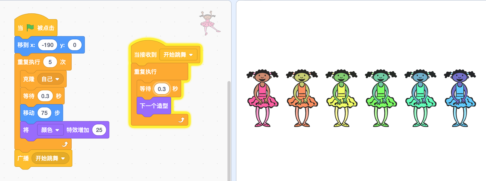

# 控制流程——控制

> 在网上或现实生活中玩过有藏宝图的游戏吗？
>
> 你必须按照指示，转几次弯，通过几个障碍物才能找到正确的路，还要根据地图的要求做出很多决定。
>
> 在Scratch中，控制积木可以让你的角色根据游戏中发生的事情做出决定。
>
> 除了最简单的游戏之外，其他游戏都需要用到该积木。
>
> 角色需要能够在许多不同条件下或在某些情况发生时提前考虑你希望他们怎么做，要控制这些，需要添加能为你的角色提供方向的积木。
>
> 控制积木就是用来完成这种要求的。

## 条件指令

> 你有没有请求父母或者爷爷奶奶做些事情，他们说“好，但有一个条件”？为了得到你想要的，就必须按照他们的要求去做。可能让你打扫完自己的卧室，他们才允许你去朋友家；可能为了吃冰激凌，不得不把蔬菜吃完。

> 在创建游戏时，你经常会发现有一组积木，仅在一种情况下使用。例如你想在计时器数完秒后或玩家按向上箭头键后积木才开始运行。这是使用条件积木的好时机，该积木只在其他事情发生时运行。接下来会使用许多新的有趣的条件积木，而且每种情况都会有所不同。
>
> 学习这些不同的积木能够帮你了解在不同情况下该使用哪个积木。

> 有些控制积木需要添加六边形积木，你所添加的六边形积木称为条件。条件是是或否（有时是真或假）。例如，“如果/否则”积木会根据条件决定选择哪条路径。

### “如果/否则”积木

> 
>
> ”如果/否则“积木能够根据你选择的条件决定角色将要做什么。如果条件为真，它将执行第一部分中的所有操作。如果条件为假，它将执行第二部分中的所有操作。

> 假设你想要角色在两种特定造型之间来回切换。如果要把要求写成普通句子，可能是：”如果角色现在是第二个造型，那么切换到第三个造型，否则（如果不是），切换到第二个造型。“
>
> 你可以使用”如果/否则“积木来执行相同的操作。
>
> 
>
> Scratch会询问目前的造型是否为”编号2“（或第二个造型）。如果是，那么代码会告诉角色换成”编号3“（角色的第三个造型）；否则它将切换到”编号2“（第二个造型）。

> 思考这个问题最好的一个方法是想象恐龙当前的造型，并在脑海中运行一遍积木。如果在开始时，恐龙当前造型是第三个，那么当条件（看造型编号是否为2）被测试时，将显示否。
>
> 
>
> 也就是说，Scratch将执行”如果/否则“积木中”否则“部分内的积木的指令。这会将角色转换成第二个造型。现在，当你再次点击绿色小旗时，当前的造型是第二个，所以当条件被测试时，将显示是。
>
> 

> 有时候，通过这样的一系列步骤可以更容易理解：
>
> 1. 单击绿色小旗时
> 2. -->如果当前角色的造型是第二个，那么
> 3. -->将当前角色的造型换成第三个
> 4. -->否则（如果不是）
> 5. -->将当前角色的造型换成第二个

### “”如果/那么“积木

> 
>
> ”如果/否则“积木并不是唯一一种条件积木，最简单的一个，而且会经常使用到的是”如果/那么“积木。
>
> 你可能会注意到，这个积木看起来很像”如果/否则“积木的上面一部分。它们的工作方式是相同的！唯一的区别在于，这个积木并不关心如果条件是错的会发生什么，它只会继续前进到下一组积木。

> 来一个现实生活中的例子！想象一下，你的朋友给你发微信，想让你去他家玩。你问父母后，他们说：”如果你的房间很干净，就让你去。“只有当你的房间干净时，你才可以出去。如果不干净，那么什么都不会发生，你也不能出去。

> 如果条件为假就不会发生什么特殊情况，该积木就很有用了。例如，你想要检查一个角色是否与另一个角色有接触，但如果两个角色没有碰到，则什么也不会发生。或者你想查看当前分数是否高于最高分，如果不是一个新的高分，那么什么也不会发生，但如果是，就让一个特殊的消息出现。

### ”等待“积木

> ”等待__“积木的作用完全和你想的一样。直到满足条件，它才会执行后面的积木。与”如果/那么“积木不同，”等待\_\_“积木会阻止Scratch执行任何其他积木，直到所设置的条件为真时才会继续。
>
> 你可能会注意到，还有一个以”等待“开头的控制积木，但它并不是条件积木。不过，由于我们正在了解等待积木，我们就来看看这个积木吧。
>
> ”等待__秒“积木非常简单。它并不会等待像”等待\_\_“这样的条件积木，而是等待一段精确的时间！有时你可能需要在事件发生后等待几秒钟，或者可能只是想减慢速度，防止积木运行得太快。
>
> 

## 循环

> 每个人都很讨厌一遍又一遍地做同样的事情。真是太无聊了！
>
> 但在Scratch中可不是这样哦！它很高兴能够一遍又一遍地做某些事情，甚至会一遍又一遍永远做下去！
>
> 如果没有循环积木，要一遍又一遍地更换造型的话，设置起来会非常困难，脚本必须超级长如下：
>
> 
>
> 有一种很简单的方法哟。你可以使用”重复执行“积木，而不用重复使用相同的代码，如下：
>
> 
>
> ”重复执行“积木能够帮你使用正确的积木，无须多次拖动。你还可以选择要重复的次数，然后再转到下一个积木。本例中，初始积木重复了10次。

> 有时你并不总是希望执行特定次数的操作。还有另一个积木会一直重复：”重复执行“积木。可以想象，这个积木会让Scratch永远重复执行包含在自己积木内的其他积木。因此，如果有一种情况，你总是想要从开始就一直做某件事，一直到点击红色停止按钮结束，那么”重复执行“积木就是你所需要的。
>
> 你会发现在”重复执行“积木后面无法再连接其他积木（添加了其他积木也没用），那是因为这个积木永远不会结束！

### 循环中的循环

> 没有人说不能在循环积木里放入其他循环积木。这种设置还有一个名字：嵌套循环。
>
> 如下示例中，”重复执行“积木内有两个”重复执行“积木。你能看明白如下积木的作用吗？
>
> 
>
> 让一个角色面向右，然后移动十步，这样再重复五次。接着让它面向左，然后移动十步，这样再重复五次。
>
> 所以这个角色会左右来回走五十步，而且由于”重复执行“的循环作用，它会一直这样做下去，直到你按下红色停止按钮。

## 循环指令积木与条件指令积木的组合

> 有一个积木既是循环积木又是条件积木。”重复执行直到__“积木可以让你反复做一件事情，直到满足某个条件为止。它就像”等待\_\_“积木一样，在条件满足之前不会进行其他操作，只是不断重复其内部的积木。
>
> 

> 下面的示例中，你会看到尚未学过的积木：”响度“。我们将在下一章中了解更多的相关内容。当麦克风的音量足够响时，”重复执行直到__“积木将会停止，下面的积木会运行起来。
>
> 
>
> 小提示：如果你没有在条件积木中添加条件，会按照条件是假的处理哦！

> 另一种常见做法是将条件置于循环内。有时这很必要，因为Scratch仅在一个时间点对条件进行检测。如果你想一直检查或测试某个条件，就需要把它放在一个循环积木中来反复检查。
>
> 如下示例中，积木会不断检查麦克风的音量。如果超过20，角色就会说”哇，这声音够大！“否则它什么也不会说。这里与”重复执行直到__“积木的区别在于，”重复执行“积木在条件满足后仍然会继续循环。
>
> 

## 停止指令

> 有时在Scratch中你会想要停止某一组积木，这是一种不同类型的控制积木。有些操作可能要花很长时间才能完成，你可以用”停止“积木停止积木的运行，Scratch可以停止从开始到任何一个积木的运行。
>
> 

> 你是否遇到过，因为发生了什么事，需要把一个”重复执行“积木停下来，或者可能希望在单击角色时停止其他的积木。因为没有条件积木来检查这一点，所以在”当角色被点击“帽子积木后添加”停止全部脚本“积木就可以做到这一点。

> “停止__”积木的下拉菜单中的不同选项决定了哪一组积木会受到影响。“停止所有脚本”的作用跟听起来一样，会让每个角色的每个脚本都停止。

> “停止这个脚本”仅停止所有附加到此积木的脚本，其他正在运行的脚本将会继续执行。例如，也许你有一个游戏，其中有许多角色在屏幕中到处反弹，直到你用鼠标点击它。在游戏结束之前，你必须把每一个都点击一遍。
>
> 

> “停止该角色的其他脚本”积木与“停止这个脚本”恰恰相反。不是停止附加到该角色上的所有脚本，而是停止所有未附加的脚本！当你希望继续运行代码的主要部分，但想停止其他积木的运行，这个积木就能用上了。

## 克隆指令

> 如果可以克隆自己，你会怎么做呢？也许让一个做家务，一个替你上学！没想过让克隆人去打工赚钱给你花吗？
>
> 你会让你的克隆人做什么呢？

> 在Scratch中，克隆积木也超级有用。如果一个角色正在做一件事，你想让另一个角色也做类似的事情，那么克隆可以让你轻松做到。你会很高兴有克隆积木，要不然还要重新组合积木。该积木能让你更容易修复代码中的问题，并且通常比你用的积木更简单。不用担心在Scratch中添加克隆哦！

### 为什么要克隆

> 你想在Scratch中克隆什么呢？如果你想创建一个模拟蚁场该怎么办呢？你会创建五十种不同的蚂蚁角色吗？那会很无聊的。下面是一个模拟蚁场的例子。
>
> 
>
> 看到那些小蚂蚁了吗？创建这么多角色是非常困难的。每个蚂蚁都需要将大量的积木复制到每个角色中才能做到。在Scratch中，有克隆就容易多了。那你要怎么做呢？

### 克隆

> 克隆有三个主要积木：“当作为克隆体启动时”、“克隆__”、“删除此克隆”。
>
> 

> 要创建当前角色的克隆，请使用“克隆自己”积木。看名字就知道了吧！这会复制当前角色的所有内容。这确实意味着一切：在舞台上的当前位置、所有图形效果、当前造型、是显示还是隐藏，等等。
>
> 但这并不意味着角色总是必须做同样的事情，那么重点是什么呢？
>
> 下面来看一个克隆角色是如何与第一个角色有所不同的例子。启动一个新项目，并添加一个芭蕾舞女演员角色，现在添加以下积木。
>
> 
>
> 第一个积木将它们移动到最左边，然后进入一个循环，每次创建一个克隆，向右移动并改变颜色，共创建五个。试着做一下吧，效果如下：
>
> 
>
> 这样舞台上现在就有六名芭蕾舞演员了。为什么会有六个呢？你创建了初始角色的五个克隆，再加上这里的初始角色，所以会有六个。

### 当作为克隆体启动时

> **每个克隆的角色都能够创建属于自己的Scratch积木**
>
> 每个克隆的角色都能够创建属于自己的Scratch积木，这就是“当作为克隆体启动时”帽子积木存在的原因！
>
> 它可以赋予每个克隆角色一个新的脚本！让我们为芭蕾舞演员添加该积木吧。将下面的脚本添加到角色中，让克隆做些动作。
>
> 
>
> 看屏幕上跳舞的芭蕾舞演员，几乎所有舞蹈演员造型都有。看位于右端的初始角色，她没有跳。
>
> 这是因为它没有使用“当作为克隆体启动时”积木，有几种不同的方法可以解决这个问题。
>
> - 第一种是在制作克隆后隐藏主角色，这样，只有五个克隆角色课件，她们都在跳舞！但在克隆开始时，你必须添加一个显示积木，否则，这五个克隆也会隐藏。
>
>   
>
> - 另一种方法是创建一个自制积木，我们将会在后续章节（第10章）了解这个内容。创建一个积木来告诉所有角色跳舞并将其添加到初始角色脚本的末尾，然后大家就会一起跳舞。学完自制积木以后，请回到此处，看看你是否能看懂该如何执行此操作。
>
> - 还有一种方法则是广播消息。你可以使用“当接收到__”积木，而不是“当作为克隆体启动时”帽子积木。创建完所有克隆后发送消息。因为所有克隆的脚本都与主角色相同，所以所有克隆都将收到自己广播的消息，同时开始跳舞！
>
>   

## 游戏——种树

> 在此活动中，你将创建一个森林，里面有两种树！你会种植一些新的树木，并观察它们的成长。
>
> 

### 选择背景

> 首先，你需要选择一个背景，然后选择几个树木角色。Scratch中已经内置了两个树木角色：Tree1和Trees。

### 种树

> 现在转到背景并添加一些代码，每次单击舞台时都会为角色创建新的克隆。让我们从“当舞台被点击”帽子积木开始。
>
> 小知识：只有在角色区中单击舞台时，才能找到“当舞台被点击”积木。
>
> 你想让代码执行两个不同的操作：克隆Tree1和Trees。听起来像是“如果/否则”积木的工作哦！你可以设置一个条件，这样有时种植一种，有时种植另一种。
>
> 因为我们并不关心种植的是哪一种树，所以可以使用“在__和\_\_之间取随机数”积木，然后将“1”和“2”放在两个空白处。这样该积木将始终在两个选项之间进行选择。但是，这是一个报告积木，这意味着它不能与“如果/否则”积木进行组合。但如果你把它放在“\_\_=\_\_”积木中，就可以了！现在进行设置来检查是否等于“1”。
>
> 你知道如下这段代码会发生什么吗？“在1和2之间取随机数”积木将随机选择数字1或数字2，如果是1，将克隆Tree1；如果是2，将创建Trees克隆！完美！
>
> 

### 控制种树位置

> 你可不想把树随便种在什么地方，要能够控制种树的位置！你应该在游戏开始时，隐藏第一个角色，否则，将会多出两棵树。这个问题很好解决，只需将“隐藏”积木添加在两个角色的“当绿色小旗被点击”积木下面，就不会显示出来了。不过不用担心，你创建的克隆会出现。
>
> 

> 你想让树长到单击鼠标的地方。单击其中一个角色，然后进入“造型”选项卡。单击树的任何部位并向上拖动，使角色的底部位于舞台形的中心。现在对其他进行同样的操作。
>
> 

> 现在要种植这些树咯！选择“当作为克隆体启动时”事件帽子积木，因为你希望每次创建新树时都执行此代码。首先，你需要显示树角色并将其移动到鼠标单击的位置。为了匹配鼠标的位置，可以使用侦测部分中的两个报告积木：“鼠标的x坐标”和“鼠标的y坐标”积木，然后将这些添加到“移到x：__y：\_\_”积木。这样，树克隆会出现在鼠标单击的位置。
>
> 
>
> 

> 小重点：将相同积木放入每个角色的快捷方式是，将积木组合从一个角色拖到角色区中目标角色顶部。

### 小树长起来

> 当小树刚种植时，通常非常小，因此将克隆体的大小设置为10%。现在要让小树开始生长了，使用“将大小增加10”积木来实现。但小树不会只长一次，在添加一个“重复执行”积木，这样它就会长好几次。
>
> 那应该长几次呢？有些树会比其他的树要大，不是吗？你可以使用“在5和10之间取随机数”积木让一些树比其他的高。
>
> 当每棵树都完成了生长，就应该等待一会儿再执行其他操作。毕竟，树木在完成生长后是不会立即死亡的！你应该添加一个“等待5秒”积木。（时间随意确定）。现在它成了一棵老树，使用9个右转10度积木来慢慢将它推倒。这样就变成了90度，或者设置其他操作，只要能够让老树平躺就可以了。
>
> 

Let's Go!