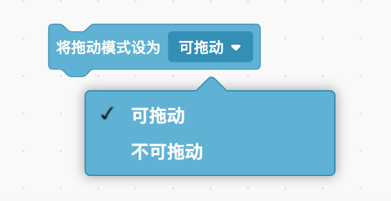
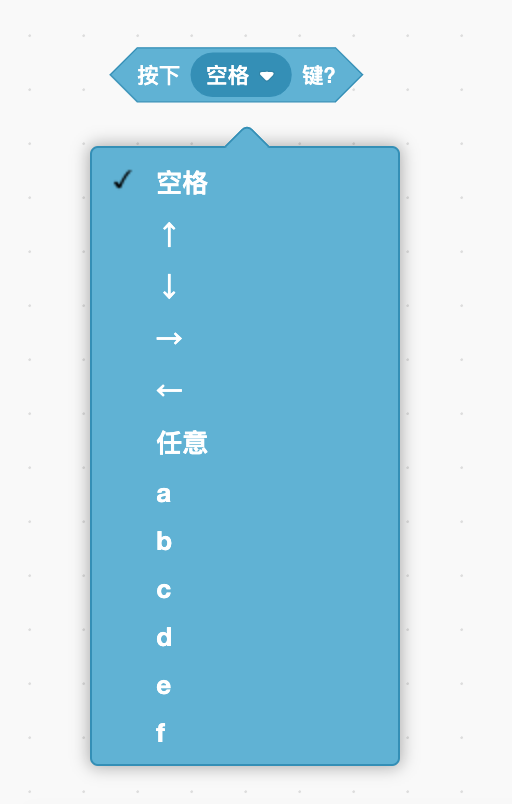

# 侦测变化——侦测

> 你知道人的五个感官吗？包括看、听、摸、闻、尝，甚至可能还有其他的！就像你用眼睛、耳朵、手指、鼻子和嘴巴来感受这个世界一样，在Scratch中你可以使用积木来判断某些东西是否真的存在！使用这些积木，你可以回答诸如“现在是几点？”，”鼠标当前是否正在触碰角色？“或”我的角色是否碰到了红色？“这样的问题。对于制作有趣的游戏来说，侦测积木非常重要。让我们跳入学习的海洋吧！

## 什么是侦测指令？

> 对于人类来说，感官让你知道情况什么时候发生，所以你可以以正确的方式做出反应。例如，如果你的皮肤感觉到烤箱很热，你会把手拿开。
>
> 在Scratch中，侦测积木的工作原理与之相同！你将使用侦测积木来帮角色理解舞台周围的情况并做出反应。这可能意味着当另一个角色过于靠近时，一些角色会改变方向，或者当它们撞到迷宫的墙壁时会说些什么。在谈论编码时，侦测积木指的是前两种类型的积木，它们来侦测条件积木或者报告积木中的单词即数值是是还是否。

> 理解这些积木的一个最佳方法是单击它们，甚至都不需要将它们拖动到工作区来执行此操作。单击任何积木都将显示当前情况，例如，单击”当前时间的时“积木，将在积木下方的小气泡中显示目前是几点；如果当前角色没有触及边缘，单击”碰到舞台边缘“积木将显示”否“。
>
> 

> 这些是侦测积木提供给自己所在积木的评测结果。你可以让角色在说话泡泡中说出目前是几点或直接发出声音，并改变角色在屏幕周围弹跳的方向。根据自己的目的，由你来决定侦测积木的位置。

> 小提示：你将使用侦测积木来帮角色了解舞台周围的情况并做出反应。

> 根据需要的信息类型，你可以使用不同的侦测积木组合。你会想，有人在玩你的游戏，玩家应该拥有多少控制权。当想到这一点，你就可以开始考虑应该使用哪些侦测积木，以及让玩家在何时获取这些信息。

## 追鼠标！

> 角色最容易感知到的就是电脑鼠标的位置。
>
> 前面章节学到了”移到__“积木，其中包括一种让角色跟随鼠标指针移动的方法。你可以使用”移到x：\_\_y：\_\_“运动积木和两个侦测积木——”鼠标的x坐标“和”鼠标的y坐标“来执行相同的操作。
>
> 
>
> 上述两种都可以实现这个功能。
>
> 为什么会有第二种方式呢？执行相同的操作确需要使用更多的积木。如果你想让你的角色跟着鼠标左右移动而不是上下移动，该怎么办呢？是不是可以让角色的y值不变，仅更改x值来跟随鼠标的位置。
>
> 

> 我们能侦测的不仅仅是鼠标在屏幕上的位置，你来看一下”按下鼠标？“积木。
>
> 
>
> 该积木能够侦测到游戏玩家是否按下了鼠标按钮。你可以将它与带有条件的重复执行积木一起使用，在鼠标未点击之前这个条件不会发生。在以下示例中，重复执行积木将持续检查是否按下了鼠标。如果是，角色将开始在屏幕上移动并更换造型。如果没有按下鼠标，角色只会在舞台跟随鼠标移动。这样你就可以将角色移动到任何地方，然后按鼠标键让它从这里开始移动。
>
> 

> 小提示：使用”？“积木时请注意：你需要在播放器模式下进行测试（请记住，当你单击舞台上的全屏按钮时，就会进入播放模式），而不仅仅是在默认视图中观看，因为鼠标在两者之间略有不同。

> 在舞台上，你可以将角色拖到任何地方。在播放（全屏）视图中，“将拖动模式设为__”积木可以更改此设置。如果将角色设置为“不可拖动”，那么你将无法在播放视图中进行拖动，它会完全按照积木要求停在某个地方。
>
> 
>
> 小提示：请记住，你需要单击舞台右上角的按钮才能转到播放（全屏）视图。

> 游戏不仅能侦测鼠标，还有键盘哟！

## 键盘

> 使用键盘让角色在屏幕上四处移动，游戏会变得更加有趣。也许你想使用空格键控制跳动，或使用箭头键控制移动。“按下__键?”条件积木能让你使用任何键来控制角色！
>
> 
>
> 你可能很疑惑，这个积木与“当按下__键”事件积木有什么不同呢？“事件”积木的工作方式类似于在文档中输入单词，如果按住某个键，它会一直重复，但速度非常慢。有时这很有用，但如果你想在屏幕上用这种方式控制角色的运动，看起来会有些生硬。为了让角色更顺畅地移动，必须要侦测方向键，并将其放在“重复执行”积木中，再加上“如果/那么”条件积木。
>
> 因为“重复执行”积木在计算机中运行速度极快，所以会使角色在屏幕上更顺畅的移动。
>
> 

> “当按下__键”积木和“按下\_\_键？”积木的另一个区别是：你可以利用侦测积木同时按下多个键，它们都会起作用。也就是说，如果你在上个例子中同时按下向上和向左箭头，角色会“将x坐标增加-10”和“将y坐标增加10”。它将沿对角线向上和向左移动！用“当按下\_\_键”事件积木是做不到这样的！

> 有时你可能想在完成一次按下和松开按键的动作来改变一次情况。例如，也许有一个键可以在循环积木中更改背景，如果不设置等待松开该键后再进行下一个操作的话，循环积木会迅速把所有背景都更换一遍。你可以使用事件循环积木执行相同的操作，但有时通过一系列的按键检查可能更容易操作背景的变化。
>
> 
>
> 此例子中，每按一次按键，只会更换一次背景，即使你按住不放，背景也不会一直更换。

> 到目前为止，这些例子使用的都是“按下__键？”积木这样的特定按键，也可以设置等待按下任何键。这是“按下\_\_键?”积木的特殊情况。“按下任意键?”积木的工作方式与其他“按下\_\_键？”积木的工作方式相同，按下任意键来激活条件。你可以使用此选项，等待玩家按任意键以启动游戏或者切换到新等级或背景。

### 触碰

> 如果使用的是触碰屏，那你的手指就是鼠标。也就是说，当你用手指触碰屏幕时，跟鼠标有关的代码积木都会启动。
>
> 这与鼠标非常相似，但还有一些其他因素需要考虑：触碰屏的特殊功能。由于没有鼠标，因此无法在未按下鼠标的情况下移动鼠标。
>
> 对于触碰屏，鼠标总是处于按下状态或根本不会有鼠标移动。
>
> 如果你想设计在触碰屏上玩的游戏，请务必在触碰屏设备上进行设置。
>
> 此外，在许多触碰屏上，没有实体键盘，因此使用“按下按键”积木将不起作用。

## 碰撞侦测

## 距离

## 日期与时间

## 问问题

## 其他侦测积木

## 游戏——特罗沃迷宫

