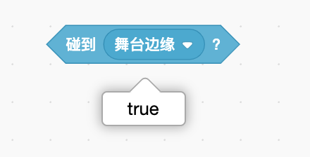
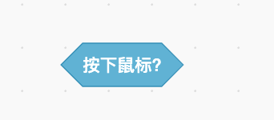
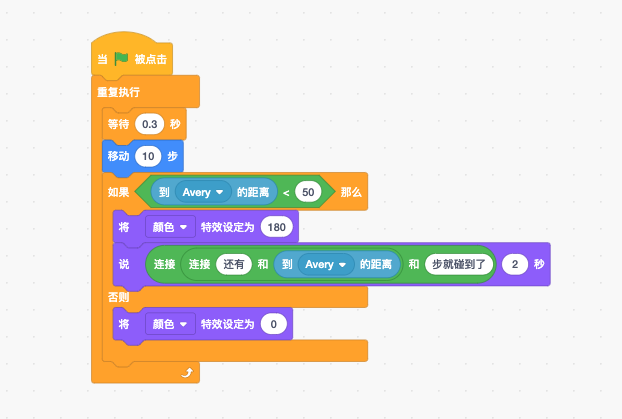

# 侦测变化——侦测

> 你知道人的五个感官吗？包括看、听、摸、闻、尝，甚至可能还有其他的！就像你用眼睛、耳朵、手指、鼻子和嘴巴来感受这个世界一样，在Scratch中你可以使用积木来判断某些东西是否真的存在！使用这些积木，你可以回答诸如“现在是几点？”，”鼠标当前是否正在触碰角色？“或”我的角色是否碰到了红色？“这样的问题。对于制作有趣的游戏来说，侦测积木非常重要。让我们跳入学习的海洋吧！

## 什么是侦测指令？

> 对于人类来说，感官让你知道情况什么时候发生，所以你可以以正确的方式做出反应。例如，如果你的皮肤感觉到烤箱很热，你会把手拿开。
>
> 在Scratch中，侦测积木的工作原理与之相同！你将使用侦测积木来帮角色理解舞台周围的情况并做出反应。这可能意味着当另一个角色过于靠近时，一些角色会改变方向，或者当它们撞到迷宫的墙壁时会说些什么。在谈论编码时，侦测积木指的是前两种类型的积木，它们来侦测条件积木或者报告积木中的单词即数值是是还是否。

> 理解这些积木的一个最佳方法是单击它们，甚至都不需要将它们拖动到工作区来执行此操作。单击任何积木都将显示当前情况，例如，单击”当前时间的时“积木，将在积木下方的小气泡中显示目前是几点；如果当前角色没有触及边缘，单击”碰到舞台边缘“积木将显示”否“。
>
> 

> 这些是侦测积木提供给自己所在积木的评测结果。你可以让角色在说话泡泡中说出目前是几点或直接发出声音，并改变角色在屏幕周围弹跳的方向。根据自己的目的，由你来决定侦测积木的位置。

> 小提示：你将使用侦测积木来帮角色了解舞台周围的情况并做出反应。

> 根据需要的信息类型，你可以使用不同的侦测积木组合。你会想，有人在玩你的游戏，玩家应该拥有多少控制权。当想到这一点，你就可以开始考虑应该使用哪些侦测积木，以及让玩家在何时获取这些信息。

## 追鼠标！

> 角色最容易感知到的就是电脑鼠标的位置。
>
> 前面章节学到了”移到__“积木，其中包括一种让角色跟随鼠标指针移动的方法。你可以使用”移到x：\_\_y：\_\_“运动积木和两个侦测积木——”鼠标的x坐标“和”鼠标的y坐标“来执行相同的操作。
>
> 
>
> 上述两种都可以实现这个功能。
>
> 为什么会有第二种方式呢？执行相同的操作确需要使用更多的积木。如果你想让你的角色跟着鼠标左右移动而不是上下移动，该怎么办呢？是不是可以让角色的y值不变，仅更改x值来跟随鼠标的位置。
>
> 

> 我们能侦测的不仅仅是鼠标在屏幕上的位置，你来看一下”按下鼠标？“积木。
>
> 
>
> 该积木能够侦测到游戏玩家是否按下了鼠标按钮。你可以将它与带有条件的重复执行积木一起使用，在鼠标未点击之前这个条件不会发生。在以下示例中，重复执行积木将持续检查是否按下了鼠标。如果是，角色将开始在屏幕上移动并更换造型。如果没有按下鼠标，角色只会在舞台跟随鼠标移动。这样你就可以将角色移动到任何地方，然后按鼠标键让它从这里开始移动。
>
> 

> 小提示：使用”？“积木时请注意：你需要在播放器模式下进行测试（请记住，当你单击舞台上的全屏按钮时，就会进入播放模式），而不仅仅是在默认视图中观看，因为鼠标在两者之间略有不同。

> 在舞台上，你可以将角色拖到任何地方。在播放（全屏）视图中，“将拖动模式设为__”积木可以更改此设置。如果将角色设置为“不可拖动”，那么你将无法在播放视图中进行拖动，它会完全按照积木要求停在某个地方。
>
> 
>
> 小提示：请记住，你需要单击舞台右上角的按钮才能转到播放（全屏）视图。

> 游戏不仅能侦测鼠标，还有键盘哟！

## 键盘

> 使用键盘让角色在屏幕上四处移动，游戏会变得更加有趣。也许你想使用空格键控制跳动，或使用箭头键控制移动。“按下__键?”条件积木能让你使用任何键来控制角色！
>
> 
>
> 你可能很疑惑，这个积木与“当按下__键”事件积木有什么不同呢？“事件”积木的工作方式类似于在文档中输入单词，如果按住某个键，它会一直重复，但速度非常慢。有时这很有用，但如果你想在屏幕上用这种方式控制角色的运动，看起来会有些生硬。为了让角色更顺畅地移动，必须要侦测方向键，并将其放在“重复执行”积木中，再加上“如果/那么”条件积木。
>
> 因为“重复执行”积木在计算机中运行速度极快，所以会使角色在屏幕上更顺畅的移动。
>
> 

> “当按下__键”积木和“按下\_\_键？”积木的另一个区别是：你可以利用侦测积木同时按下多个键，它们都会起作用。也就是说，如果你在上个例子中同时按下向上和向左箭头，角色会“将x坐标增加-10”和“将y坐标增加10”。它将沿对角线向上和向左移动！用“当按下\_\_键”事件积木是做不到这样的！

> 有时你可能想在完成一次按下和松开按键的动作来改变一次情况。例如，也许有一个键可以在循环积木中更改背景，如果不设置等待松开该键后再进行下一个操作的话，循环积木会迅速把所有背景都更换一遍。你可以使用事件循环积木执行相同的操作，但有时通过一系列的按键检查可能更容易操作背景的变化。
>
> 
>
> 此例子中，每按一次按键，只会更换一次背景，即使你按住不放，背景也不会一直更换。

> 到目前为止，这些例子使用的都是“按下__键？”积木这样的特定按键，也可以设置等待按下任何键。这是“按下\_\_键?”积木的特殊情况。“按下任意键?”积木的工作方式与其他“按下\_\_键？”积木的工作方式相同，按下任意键来激活条件。你可以使用此选项，等待玩家按任意键以启动游戏或者切换到新等级或背景。

### 触碰

> 如果使用的是触碰屏，那你的手指就是鼠标。也就是说，当你用手指触碰屏幕时，跟鼠标有关的代码积木都会启动。
>
> 这与鼠标非常相似，但还有一些其他因素需要考虑：触碰屏的特殊功能。由于没有鼠标，因此无法在未按下鼠标的情况下移动鼠标。
>
> 对于触碰屏，鼠标总是处于按下状态或根本不会有鼠标移动。
>
> 如果你想设计在触碰屏上玩的游戏，请务必在触碰屏设备上进行设置。
>
> 此外，在许多触碰屏上，没有实体键盘，因此使用“按下按键”积木将不起作用。

## 碰撞侦测

> Scratch不仅可以侦测何时按下按键，它还可以判断两个角色是否有接触，以及角色是否触碰了鼠标、边缘，甚至是屏幕上的特定颜色。
>
> 小知识：当角色在游戏中相互接触时，通常称为碰撞侦测。这个有趣的叫法可以告诉你两个角色相互碰撞的时间。

### 碰到__？

>“碰到__？”条件积木会报告是或否，具体取决于当前角色是否碰到了你在下拉列表中选择的内容。
>
>
>
>例如，“碰到鼠标指针”一个很常见的用途是用鼠标接触角色来更换它的造型。你假设游戏中有一个能显示游戏说明的按钮，你可以这样设置：当鼠标移到按钮上，它就会改变颜色，这样玩家就知道这个按钮是可以点击的了。

> 你也可以使用此积木来检查角色是否触碰到了舞台的边缘或另一个角色。如果角色碰到了特定的角色，可能玩家就输了，你可以添加声音和消息让玩家知道。或者可能碰到边缘就说明玩家赢了，就能进入到平台游戏的下一个页面了。等等等等类似的情况。

### 碰到颜色？

>还有两个积木可以侦测你的角色是否碰到了特定的颜色，而不是像鼠标指针或其他角色等物体。
>
>
>
>当角色接触所选颜色时，“碰到颜色___？”积木变会做出反应。
>
>
>
>“颜色__碰到\_\_？”积木会找当前角色中的第一种颜色，并感知它是否碰到了另一个角色或背景中的其他颜色。
>
>

> 使用这些积木的方法有很多种！然我们首先看一下如何使用“碰到颜色__？”积木。“碰到颜色\_\_？”积木通常用于制作迷宫或平台游戏，这样就可以侦测当前角色是否碰到了墙壁。你还可以为下一关制作一个特殊的彩色门，例如，你可以制作这样一个迷宫。如果角色碰到了蓝色墙壁，就说明它迷了路；如果碰到了粉色的门，就会升级进行入下一关。

> 小重点：Scratch中最常见的漏洞之一是，当你的脚本在侦测角色中由许多不同色调构成的颜色时，它只会检测其中的一种色调，甚至可能看起来就没在侦测。

> “颜色__碰到\_\_？”积木作用更大！你可以在角色中挑选任何一种颜色，利用该积木就能知道它是否碰到了不同角色的其他部分。对绘制自己的角色也很有帮助，这样就可以确切地知道要侦测的颜色。

> 当建造迷宫时，该积木也还有帮助。在角色每端各放一个与背景颜色一样的像素点，就像构建一个四向传感器，可以侦测角色是否即将进入迷宫墙。如果像素点碰到了墙壁的颜色，你可以告诉角色站住或向反方向移动！例如可以使用下面的脚本来阻止角色撞到红墙。

> 你可以在角色的顶部，左侧和底部都添加像素点，这样它就能侦测到这几个方向的墙壁了。但如果玩家能看到这些点，会感觉很难看。所以应该使用非常接近背景颜色的颜色，但不能完全相同。
>
> 你也可以用另一种方法做到这样！为角色制作一个造型，即一个彩色的盒子，与角色的大小相同。现在你可以让角色切换到这个造型，侦测盒子的颜色是否碰到了迷宫的颜色，然后再把造型更换回来。此过程发生得极快，甚至你都没有注意到造型的变化。

> 如果你想知道角色何时碰到墙壁，可以使所有边框的颜色保持一致。但有时你会想知道角色碰到的是哪一边。例如，如果你要制作一个平台游戏，并且角色要掉到地上，那么你就需要知道它碰到的是底部还是顶部、左边还是右边。你可以添加像这样的侦测造型和代码来达到目标。

> 看看你选择颜色的这个盒子，你会注意到三个条形：颜色，饱和度和亮度：
>
> 
>
> - **颜色非常容易理解，就是你选择颜色的地方。**
> - **饱和度控制颜色的色调。0意味着你看不到色彩，只有暗灰色；100意味着最艳丽。**
> - **亮度控制颜色的明暗。0让颜色完全变黑，100使颜色尽可能明亮。**

### 一次还是一直？

> 有时你可能想让代码仅在发生什么情况时才侦测两个角色是否有接触。而在其他时候，想让它侦测角色是否在接触某些东西。

> 看如下这个代码。当你按下绿色小旗时，它们都在侦测当前角色是否碰到了蝴蝶。但第一个没有重复执行。也就是说，如果在点击绿色小旗时两个角色没有接触，则代码结束，并且不再进行侦测。即使它们稍后有接触，这段代码也不知道。
>
> 

> 如下一组代码，通过使用“重复执行”积木一直侦测当前角色是否碰到了蝴蝶。由于在“重复执行”积木中，当前角色也被设为“移动10步”，所以角色每次移动时都将侦测是否碰到了蝴蝶，如果碰到了，它就会感觉到，并说“碰到了”两秒钟。
>
> 

## 距离

> 如果你想让两个角色侦测到自己正在靠近而不是接触某个东西，该怎么办呢？
>
> 有一个积木可以告诉你的角色距离某个物体有多远，即“到__的距离”积木，该积木可以让角色知道自己与其他角色或鼠标指针的距离。
>
> 例如，如果两个角色靠的很近，可能是你想让他们脸红！要怎么避免呢？你可以使用“到__的距离”积木来侦测两个角色之间的距离。在这个例子中，一个角色根据与另一个角色的距离来改变颜色。
>
> 

> 你还可以使用“到鼠标指针的距离”选项来侦测鼠标指针与角色的接近程度。此示例根据鼠标的接近程度来更改角色的大小，不过基于鼠标与角色的接近程度，你可以随时使用此积木来说明一些情况的发生。
>
> 

## 日期与时间

> 你去跟同学朋友一起出去玩，是不是很讨厌对方迟到？幸运的是，Scratch中有一些积木可以帮助我们守时！它可以告诉我们今天的日期、玩了多久的游戏，甚至是自2000年1月1日以来已经过了多少天！让我们来了解一下这些积木。

### 当前的日期和事件积木

> “当前时间的__”积木启动后可以告诉你的角色现在的年、月、日、时、分、秒或星期。
>
> 
>
> 你可能会发现，在游戏中，询问某人的生日、想计算某人的年龄，或者只是想以不同的方式显示日期和时间，这些积木就很有用。甚至你可以让角色在不同的日子做不同的事情。也许你可以让角色在周一很沮丧，因为必须要去上学了！

> “星期”的选项有点奇怪。它将星期报告为一个数字，星期日是1，星期六是7。如果想显示实际的星期而不是数字，最佳的方法是制作一个表，然后使用特殊的变量积木。（你将在下一章中了解有关如何执行此操作的更多信息）

### 计时器积木

> 如果你想制作一款游戏，玩家在一局中玩的时间越长，分数就越高，该怎么办呢？
>
> 你可以试试”当前时间的秒“积木，但每次达到60时，它将重置为零。
>
> 为此，我们需要使用”计时器“积木。游戏开始时它从0开始计数，当脚本运行到”计时器“积木时，它会告诉角色这个数字是什么，并运行其他积木。

> 查看计时器是否在工作的简单方法就是让角色告诉你它运行了多长时间。你可以将”计时器“积木添加到”说__“积木中，然后运行以查看计时器的计时情况。单击绿色小旗，你的角色将立即显示已经过了多少秒。
>
> 

> 你可能已经注意到与计时器相关的另一个积木：”计时器归零“。这会把计时器清零。你会发现，在制作游戏时使用计时器会非常方便。也许你需要给玩家一些指示，这样就不用马上启动游戏；或者想在变换到下一级时重置计时器。在游戏过程中，重置计时器的原因真的有很多哟！

### 2000年至今的天数积木

> 

## 问问题

## 其他侦测积木

## 游戏——特罗沃迷宫

