# 非常重要的变量——变量指令

> 你已经学过一些关于变量的知识了，比如”换成__造型“外观积木和”鼠标的x坐标“侦测积木。你也可以创建自己的变量哦！几乎每个项目都要记录情况的变化。本项目已经创建了一些变量（例如角色的位置），但为了让项目更上一层楼，你就要学会创建自己的变量来记录项目中其他的重要事项。

## 变量

> 可能你在学校听说过变量。通常，大多数学校将变量作为七年级或八年级数学课程。如果你还没有学到，请不要担心。本节将带你理解所需要的内容！
>
> 小知识：变量用于表示可以具有不同值的内容。在Scratch中，这个值可以是单词，也可以是数字。

### 什么是变量？

> 在新的学年，或许你要告诉新老师你的名字。不是每个人的名字都相同，对吧？所以名字就是个变量！与不同的人交谈，老师喊的名字也都不一样。前一分钟，老师可能正和一个名叫安德鲁的学生谈话，下一分钟可能又跟布雷特聊了起来。

> 名字是你接触的第一个变量，你跟不同的人交谈，它就具有不同的值。但当遇到某人时，实际上你并没有使用“名字”这个词，除非你不记得那个人叫什么了，你会用实际的名字来代替这个变量。

> 变量的值不仅可以用单词来表示，也可以记作数字。例如，现实生活中的另一个变量就是你的年龄。你不断长大，年龄也会随之增长，所以它总是在变化！

> 小重点：变量并不只有一个值。例如，在游戏中，可以使用像分数这样的变量来显示当前分数，但每当游戏玩家成功（或失败）做了某事时，分数就会发生改变。

### 建立变量

> 要建立一个新变量，显然必须从变量开始学起！选择深橙色的变量积木，就应该能看到建立一个变量按钮。
>
> 
>
> 在这里，你可以对自己的变量进行命名。为了便于记忆，请选择一个有意义的名称，要不然就会忘记自己的变量是什么了！如果变量要计算一些东西，比如玩家还剩几条命，就可以起名为“剩余生命数”。如果你的游戏很复杂，包含好几个变量，以变量的作用来命名会好记一些。通常，玩家是看不到变量名称的，所以变量的名称对你来说更为重要。

> 创建新变量时，还有两个选项可供选择。你可以选择“适用于所有角色”或“适用于当前角色”，也称为全局变量和局部变量。

- 全局变量

  > 可以从任何角色或舞台的脚本设置来更改全局变量。它是全局性的，所以随处可见。无论将全局变量放在哪个脚本中，你使用的是完全相同的变量。游戏中某些部分使用的全局变量不会只针对一个角色。

  > 像分数这样的变量（百分制）就是一个全局变量，因为整个游戏中都用的这个。不同的角色分数不尽相同，但所有角色都采用相同的分数变量。之前学的名称和年龄这两个变量示例，属于局部变量，因为每个角色的变量各不相同。

- 局部变量

  > 如果在创建变量时选择“仅使用当前角色”，那就是局部变量。你能想到当地的一些事物吗，例如你的学校？现在，想想住在另一个城镇的朋友，他有自己当地的学校，不能去你的，你不能去他的。这就是局部变量的工作原理！
  >
  > **局部变量为谁而建，谁才可以使用，其他角色将无法查看或更改。**

### 更改变量值

> 有两种方法可以更改变量的值，就像可以设置或更改角色的x坐标和y坐标一样，你可以将变量设置为特定值，也可以添加或减去当前值。
>
> 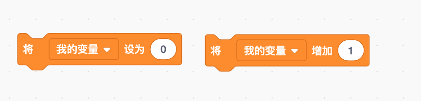
>
> “将__设为\_\_”积木能够将变量具体化。你可以在此处使用单词或数字，甚至像“计时器”这样的圆形积木。第一次创建变量时，你将用到该积木，因为它可以更改变量的值。

> 我们通过一个示例来学习如何设置变量。当按下空格键，积木会为“年龄”和“名字”设置变量，通过“将年龄设为8”积木和“将名字设为螃蟹”来完成。对于海星也是一样，因为你仍然要使用相同的变量，只不过将年龄和名字设为10和海星。
>
> 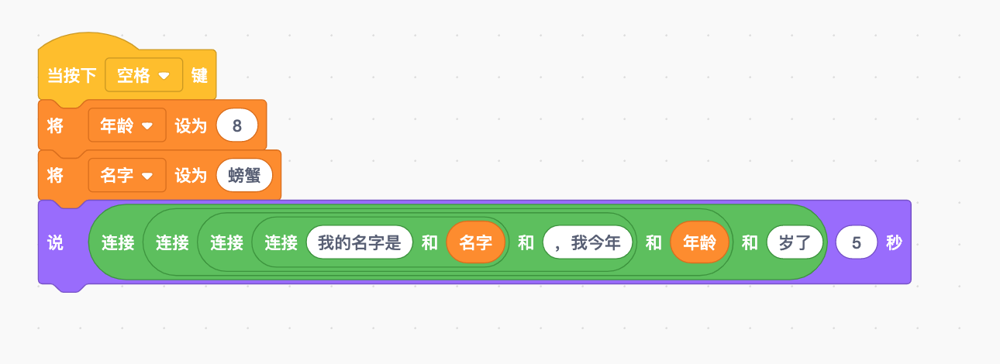
>
> 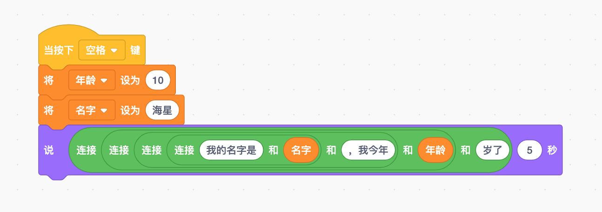
>
> 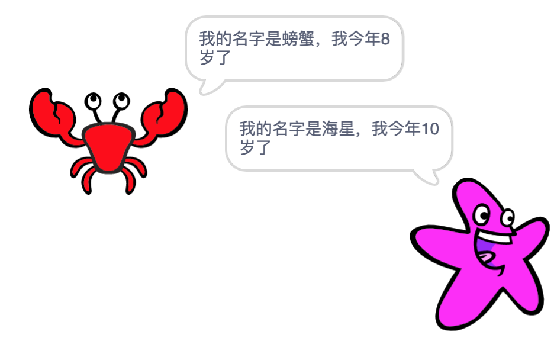
>
> “将__增加\_\_”积木增加或减少变量的当前值。仅当变量值为数字时，此块才有效。如果将变量设为单词，然后尝试使用此块来更改变量值，则会变为“NaN（非数值）”。这是什么？这代表不是数字。也就是说，你在尝试用一个词来做数学！这就像问一个人“6+煎饼等于多少？”这没有任何意义，但也可能很好吃。^\_^

### 显示变量和值

> 就像其他圆形积木一样，当创建变量时，可以将它显示在舞台上。例如，你可能想显示“分数”变量，以便玩家知道他的表现。如果选中积木区变量左侧的复选框，就会显示在舞台上供玩家查看！
>
> 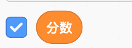
>
> 与其他圆形积木不同，在舞台上，变量有几种不同的显示方式。如果双击舞台上的变量，它将更换不同的显示方式。这些称为变量视图，共有三个视图选项。
>
> - 正常显示：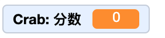
> - 大字显示：
> - 滑杆：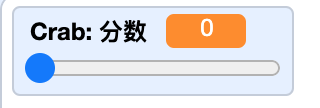

> 正常显示是最简单的，会一直在其值旁边显示变量的名称。如果你想让玩家看到多个变量，比如每个角色都有不同的分数，这个方式就很好用。
>
> 大字显示只显示变量的当前值，旁边没有名称。如果就需要在舞台上显示一个变量，就像全局分数变量一样，那这个积木就是你想要的。
>
> 滑杆视图与其他两个略有不同。它不仅会显示变量的值，还能让玩家对值进行调整！玩家可以向左或向右拖动滑杆来设置。你可以用它来让玩家选择游戏的难度或速度。

> 如果右键单击舞台上显示的变量，会出现几个选项，你将看到三种不同的变量视图供你选择。
>
> 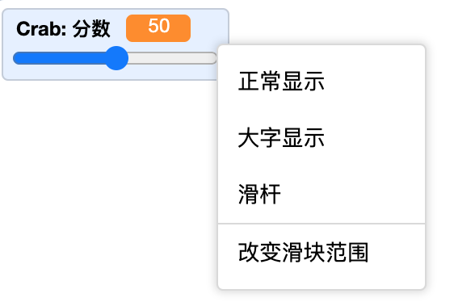

### 显示和隐藏变量

> 就像可以使用积木将舞台上的角色显示或隐藏一样，你也可以使用积木将舞台上的变量显示或隐藏。如果要在不同时间显示不同的变量，该积木就可能比较有用。一起来看看下面的脚本。
>
> 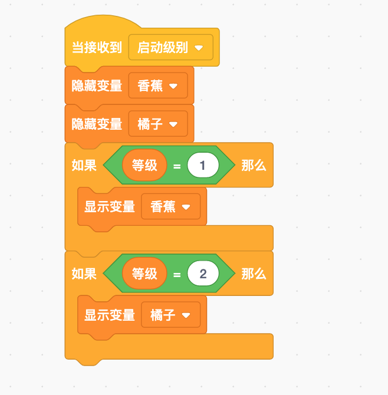
>
> **小重点：**你无法使用积木来更改变量视图，必须双击或右键单击，并选择要显示的视图模式。即使你将其隐藏，Scratch也会为你记住，所以不要担心隐藏变量会搞乱滑杆。当它再次出现时，将返回之前的视图模式。
>
> 当“启动级别”（为游戏等级设置的消息）运行时，此代码会隐藏变量，然后显示“香蕉”或“橙子”变量，具体取决于是第一级还是第二级。

## 列表

> 当你只想记住一个数字或句子时，变量比较有用。但有时你可能想记住很多数字和单词，使用不同变量的话，很快就会变得混乱。这时候你可以使用列表来完成！想想你见过的列表，比如购物列表或学校供应列表。如果没有列表，而是把每样东西都记在不同的纸上，会怎么样呢？想要翻找这堆纸会让人抓狂，而且很容易弄丢。列表会将所有相同类型的项目保存在一个地方，有助于整理，Scratch中的列表也可以为你做同样的事情。

> 小知识：列表是一个特殊变量，你可以创建该变量，以在一个位置存储多个数字或单词，在大多数情况下类似于真实世界的列表。

> 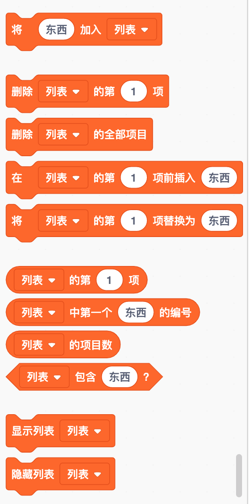

### 建立一个列表

> 首先，你需要建立一个列表。在建立变量的同一个深橙色变量部分中，你可以看到一个写着“建立一个列表”的按钮。
>
> 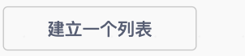
>
> 点击后会出现一个弹出框，比如描述列表类型的名称。建立后，会出现一堆积木。
>
> 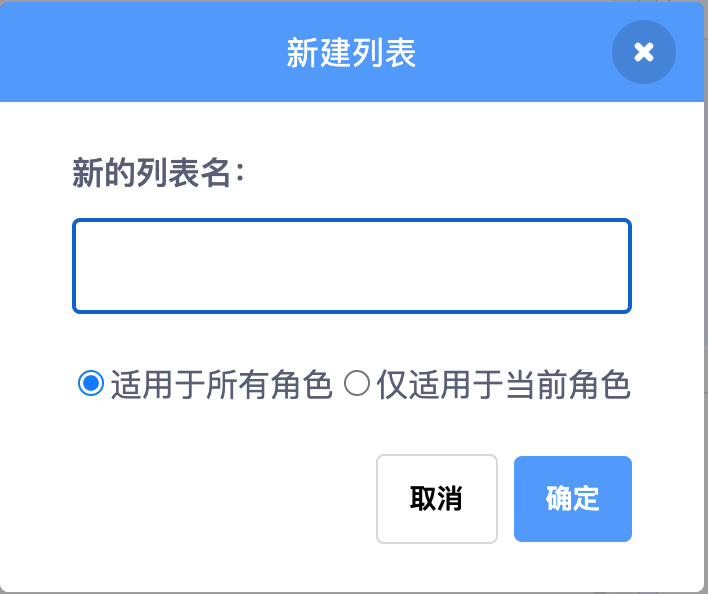

> 建立列表后，你可以添加一些项目。下面的示例，是一连串问题的列表。它不一定是单词列表，也可以是标点符号列表、数字列表或数字、单词和标点的组合列表。更改列表内容的方法有两种：在舞台中直接更改，或使用积木进行更改。

### 直接更改

> 更改列表最简单的方法是从舞台上进行更改！你可以直接进入列表，根据需要添加、删除或调整。
>
> 你会在舞台上看到一个框，列表名称位于顶部，左下角有一个“+”符号，底部中间有“长度0”。加号可以让你在列表中添加内容。点击一下，试试！你可以输入任何内容。列表中的每个项目都称为条目，列表中输入的条目数量和长度是没有限制的。
>
> 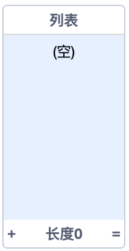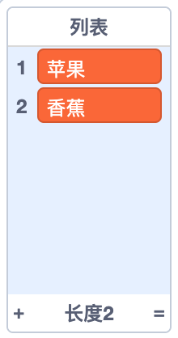
>
> 如果要从列表中删除某些内容，首先需要单击该条目。会在该条目后面看到一个“x”。如果单击它，条目将会消失。
>
> 如果要更改列表中的内容，仍然需要单击该条目，但不要点击“x”，直接删除或添加文本。

### 使用积木添加、删除和调整列表项目

> 你还可以使用积木来调整条目，这时要用到列表索引。索引对每个条目进行编号，帮你告诉scratch要对列表执行的操作。
>
> 例如：“世界上最高的建筑物是哪一个？”在“问题”列表中的索引为1，“美国的首都是？”的索引为2。你始终可以在条目左侧的列表中查看每个项目的索引。
>
> 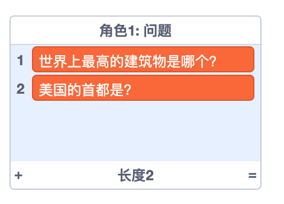

> 索引也是一个变量，因此它可以指代列表中的不同项。如果从“问题”列表中删除“世界上最高的建筑物是哪一个？”，那么“美国的首都是？”便会向上移动，现在它的索引就成了1。
>
> 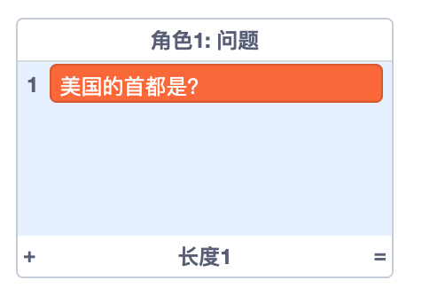

> 你需要了解一下索引，以便可以使用大多数列表积木。例如，“删除__的第\_\_项”积木会删除你输入的索引号中的任何条目。

> “将__加入\_\_”积木不需要索引号。它只是将条目添加到列表的末尾。有时你并不关心条目的顺序，只需将所有条目放在一起。

> 如果确实需要排列顺序，可以使用“在__的第\_\_项前插入\_\_”积木，将项目添加到指定位置。

### 列表的使用

> 如果我们在需要时无法从列表中获取项目，列表就没什么意义了。要使用列表中的内容，你需要使用“__的第\_\_项”积木。这个积木本身并没有太大作用，需要与另一个积木组合使用。它的形状像椭圆形积木，因此可以在任何有椭圆形空缺的积木中使用。例如，由于你的列表都是问题，因此最好使用“询问\_\_并等待”侦测积木。
>
> 此例子中，一个角色问一个问题。你还可以将索引从“1”更改为列表长度的随机积木来询问随机问题。
>
> 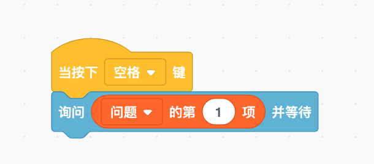
>
> 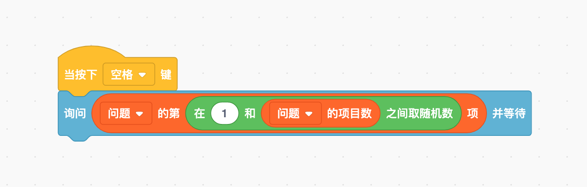

> 如果你想询问列表中的所有问题该怎么办呢？你怎么知道要问多少问题呢？你可以在“重复执行__”积木内使用“\_\_的项目数”积木。然后你让角色问索引上的第一项并等待，然后继续下一个，依次类推。
>
> 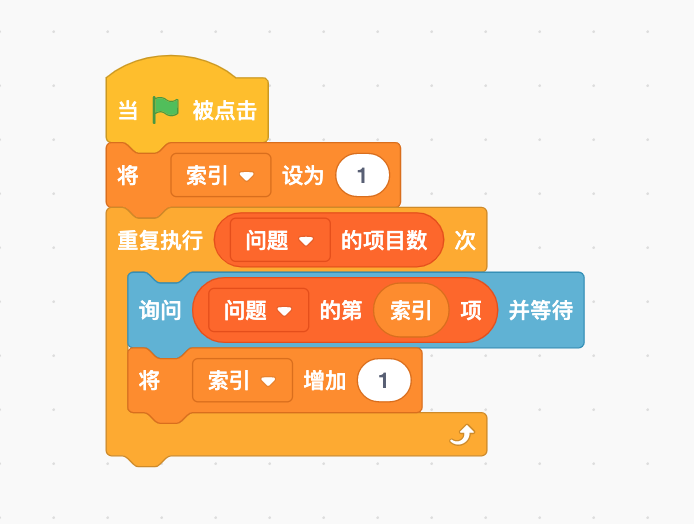

### 已经添加过了吗

> 有时列表可能会很长，而且你不记得是否已经添加了某些内容。你可以使用“__包含\_\_?”积木来代替循环整个大列表！如果你希望列表中同样的问题只出现一次，你可以使用这个脚本来检查每个问题是不是已经有了，如果没有就加上去。
>
> 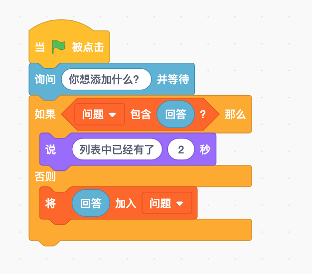

### 并行列表

> 很多时候，建立两个彼此相关的列表是有用的。例如，你有一个问题列表，还需要答案，想让答案与正确的问题相匹配！你来添加第二个答案列表。现在你可以编写一个代码来询问每个问题并检查你是否得到了正确的答案。
>
> 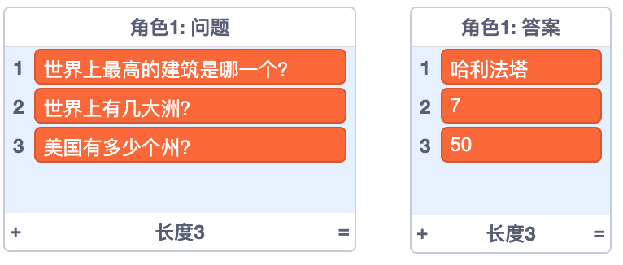

> 针对上述两个并行列表，编制积木如下：
>
> 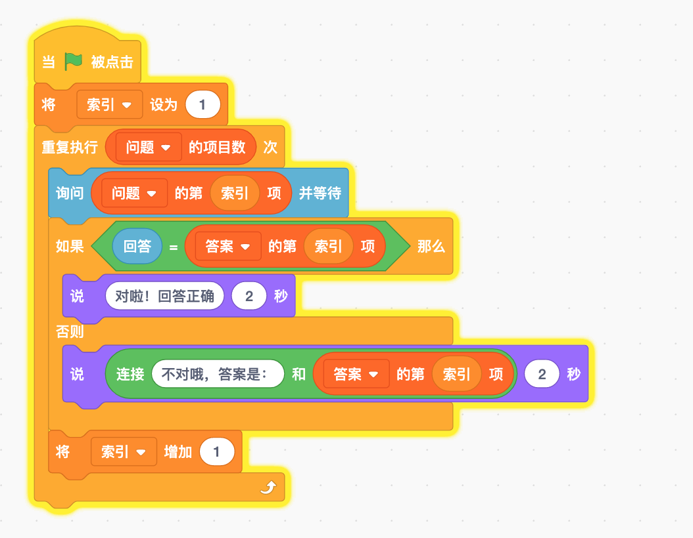

> 并行列表可能包含两个以上的信息列表。例如，如果你想通过建立角色在舞台上的位置列表来让它走回头路，就需要一个角色的x坐标列表，一个y坐标列表和一个方向列表。

### 使用列表记东西

> 我们可以使用列表记住变量的不同值。如果你想记住角色在每次移动时的x坐标和y坐标，可能需要两个x坐标和y坐标列表来保存位置。这里的第一部分积木能确保从列表中删除所有项目，因此就不会继续添加以前运行的位置。
>
> 利用角色先前的位置列表，可以让另一个角色做些其他动作。例如，你可以为你的角色创建一个小角色，在角色离开后，小角色会跟随它到每个新位置。
>
> 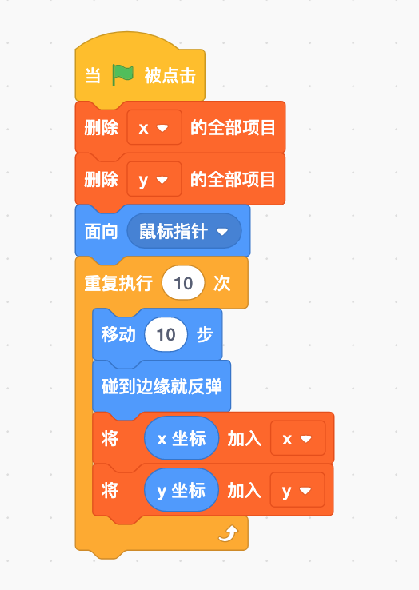

> 当你使用列表记住当前项目的内容时，通常会希望每次都重新开始。要做到这一点，就要在启动时删除列表中的所有内容，这样就不会包含上个玩家留下的任何信息了。但是如果你希望列表每次都能继续添加很多内容，那么你可以将条目保留，下次它们仍然会存在。

### 显示和隐藏列表

> 就像变量一样，也可以使用积木显示和隐藏舞台上的列表。这样，你就可以决定在适当的时间向玩家显示列表。例如，某个列表可能只有在玩家达到特定等级后才有意义，或者，可能只需要在介绍屏幕上显示高分的列表，然后在玩家进入游戏时隐藏。你可以使用“显示列表\_\_”和“隐藏列表\_\_”积木来完成这项工作。
>
> 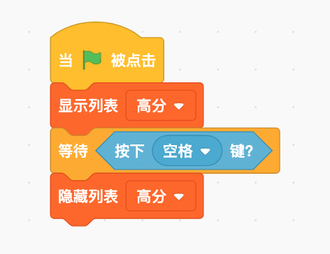

## 游戏——数字猜猜猜

> 在此活动中，你可以创建一个数字猜谜游戏。角色会想一个数字，然后玩家来猜这个数字是多少。角色会给出提示，告诉玩家他的猜测是高于还是低于实际数字。

### 猜谜游戏——数字是多少

>与所有活动一样，第一步是添加你喜欢的角色。你想让它在1到100之间随机取数来让玩家猜。这听起来像是“在__和\_\_之间取随机数”积木的工作哦！你希望自己的角色能记住它所选择的数字，所以应该把它变成一个变量。建立一个新变量并将其设置为选择一个随机数。本示例把变量命名为“神秘数字”。
>
>现在使用“询问__并等待”积木让玩家输入所猜数字。你要建立两个变量：“神秘数字”变量和“答案”变量，“答案”变量是玩家输入的数字。
>
>你可不想让玩家只猜一次，因为要一次就猜对是基本不可能的！在“询问__并等待”积木外部添加“重复执行直到\_\_”积木，并让条件检查“答案”是否与神秘数字相符。如果是，玩家就赢了！如果不是，它会让玩家再次猜测！

> 如果玩家需要再猜，你要给他一个提示，以便他知道答案是高还是低。毕竟，给玩家一点点帮助才算公平。你可以使用几个“如果/那么”积木来检查答案是高于还是低于神秘数字。如果高了，你可以让角色说“太高了！”如果低了，可以让它说“太低了！”。
>
> 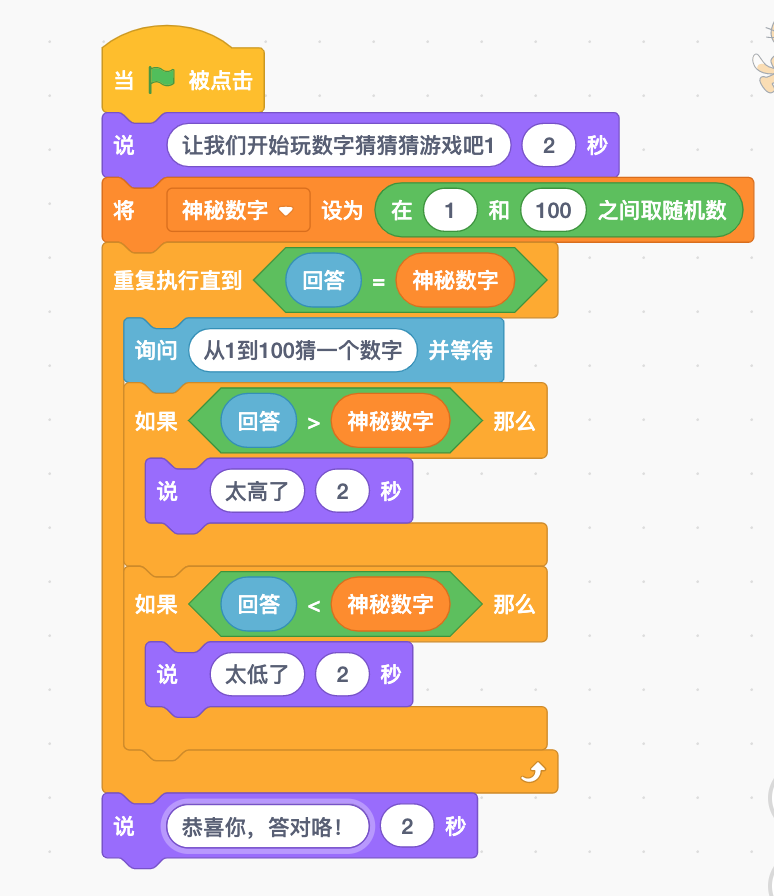

### 太好玩了——再玩一次

> 如果玩家想多玩几次怎么办呢？你可以让游戏很容易就重新开始哦，要做到这一点，就要用一个新的问题询问玩家是否想再玩一次，然后重复执行所有积木。除了帽子积木之外，将所有其他积木都放在另一个重复执行积木内，这样就能让整个游戏重新开始。
>
> 但还需要一个条件来告诉它应重复多少次！你可以问玩家是否想再玩一次，如果玩家不想，游戏结束。
>
> 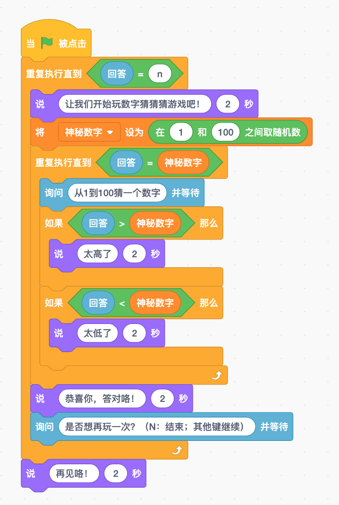

Let's Go!