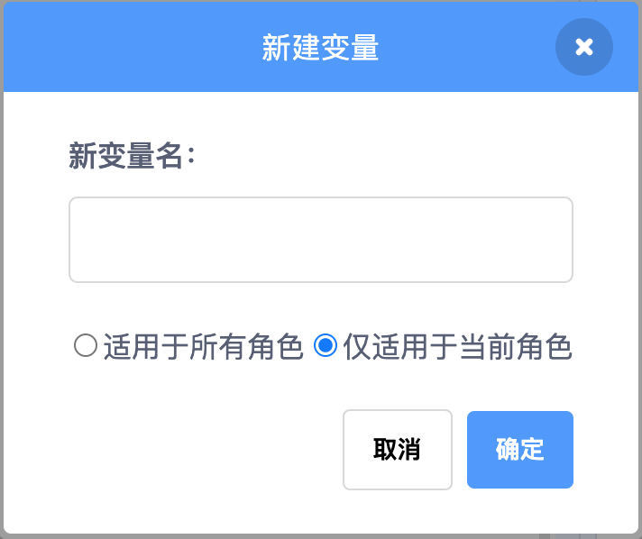

# 非常重要的变量——变量指令

> 你已经学过一些关于变量的知识了，比如”换成__造型“外观积木和”鼠标的x坐标“侦测积木。你也可以创建自己的变量哦！几乎每个项目都要记录情况的变化。本项目已经创建了一些变量（例如角色的位置），但为了让项目更上一层楼，你就要学会创建自己的变量来记录项目中其他的重要事项。

## 变量

> 可能你在学校听说过变量。通常，大多数学校将变量作为七年级或八年级数学课程。如果你还没有学到，请不要担心。本节将带你理解所需要的内容！
>
> 小知识：变量用于表示可以具有不同值的内容。在Scratch中，这个值可以是单词，也可以是数字。

### 什么是变量？

> 在新的学年，或许你要告诉新老师你的名字。不是每个人的名字都相同，对吧？所以名字就是个变量！与不同的人交谈，老师喊的名字也都不一样。前一分钟，老师可能正和一个名叫安德鲁的学生谈话，下一分钟可能又跟布雷特聊了起来。

> 名字是你接触的第一个变量，你跟不同的人交谈，它就具有不同的值。但当遇到某人时，实际上你并没有使用“名字”这个词，除非你不记得那个人叫什么了，你会用实际的名字来代替这个变量。

> 变量的值不仅可以用单词来表示，也可以记作数字。例如，现实生活中的另一个变量就是你的年龄。你不断长大，年龄也会随之增长，所以它总是在变化！

> 小重点：变量并不只有一个值。例如，在游戏中，可以使用像分数这样的变量来显示当前分数，但每当游戏玩家成功（或失败）做了某事时，分数就会发生改变。

### 建立变量

> 要建立一个新变量，显然必须从变量开始学起！选择深橙色的变量积木，就应该能看到建立一个变量按钮。
>
> 
>
> 在这里，你可以对自己的变量进行命名。为了便于记忆，请选择一个有意义的名称，要不然就会忘记自己的变量是什么了！如果变量要计算一些东西，比如玩家还剩几条命，就可以起名为“剩余生命数”。如果你的游戏很复杂，包含好几个变量，以变量的作用来命名会好记一些。通常，玩家是看不到变量名称的，所以变量的名称对你来说更为重要。

> 创建新变量时，还有两个选项可供选择。你可以选择“适用于所有角色”或“适用于当前角色”，也称为全局变量和局部变量。

- 全局变量
- 局部变量

### 更改变量值

### 显示变量和值

### 显示和隐藏变量

## 列表

### 建立一个列表

### 直接更改

### 使用积木添加、删除和调整列表项目

### 列表的使用

### 已经添加过了吗

### 并行列表

### 使用列表记东西

### 显示和隐藏列表

## 游戏——数字猜猜猜

### 猜谜游戏——数字是多少

### 太好玩了——再玩一次

Let's Go!